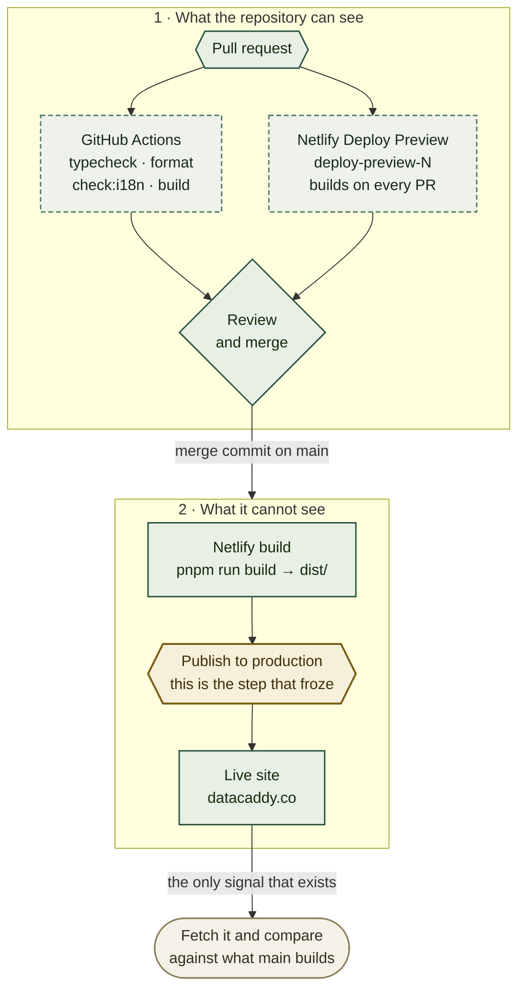

# Getting a change onto `datacaddy.co`, and knowing that it got there

> **Written 2026-09-14, during a publish freeze that is still unresolved.** Four merges to `main`
> — pull requests [#21](https://github.com/ASO-DB-Solutions/site-datacaddy/pull/21),
> [#23](https://github.com/ASO-DB-Solutions/site-datacaddy/pull/23),
> [#24](https://github.com/ASO-DB-Solutions/site-datacaddy/pull/24) and
> [#25](https://github.com/ASO-DB-Solutions/site-datacaddy/pull/25) — have produced no production
> deploy, while every pull request's preview built and passed. This guide exists because that
> situation was undiagnosable for hours, and it was undiagnosable for one reason: **nothing in the
> repository reports whether a deploy happened.**

Merging is not shipping. They are two events, minutes apart on a good day, and **no signal
connects them**. Everything up to the merge commit is instrumented — branch, review, CI, preview.
Past it there is nothing, and a frozen deploy looks exactly like a successful one.

## Where this fits



Dashed boxes **gate but never publish**. The amber box is where publication happens, and where it
stopped: it emits no status, sends no notification, and writes nothing back to the commit that
triggered it.

## Already-known values

| | |
|---|---|
| Production branch | `main` — nothing else deploys |
| Build command | `pnpm run build`, publish directory `dist/` (from `netlify.toml`) |
| Live address | `https://datacaddy.co` |
| Preview address | `https://deploy-preview-<N>--datacaddy.netlify.app` — **Team Owner only** on the Free plan |
| Deploy status on a merge commit | **None.** Verified: `d82c01a` deployed successfully and still reports `state=pending, statuses=0` |

That last row is the whole problem. A merge that deployed and a merge that did not are
indistinguishable from the repository.

## Read this before you start: what this can't do

**Nothing here can trigger or unstick a production deploy.** The Netlify account is held by the
site owner; this project has no build hook, no CLI, and no token. The repository's only lever is
pushing to `main`, and if publication is blocked that produces another preview and nothing else.

**Do not merge again to "retry".** On 2026-09-14 four merges went in against a frozen publisher.
Each added a commit, a preview and a round of confusion; none changed production. If one merge
does not publish, the next three will not either.

## 1. Merge — the whole deploy procedure

There is no deploy step. Merging to `main` is the deploy. `gh pr merge` fails against this
organisation's fine-grained token, so merge over SSH:

```bash
git checkout main && git pull --ff-only origin main
git merge --no-ff <branch> -m "Merge pull request #<N> from <branch>"
git push origin main

git branch -d <branch>
git push origin --delete <branch>
```

## 2. Verify against the live site — not against the merge

The bundle filename carries a content hash, so it changes whenever the JavaScript changes. That
makes it the cheapest reliable signal:

```bash
curl -s https://datacaddy.co/ | grep -oE 'main-[A-Za-z0-9_-]+\.js' | head -1
ls dist/assets/main-*.js | xargs -n1 basename     # what main currently builds
```

Two different names means **not deployed**.

**For a change that touches only HTML, the sitemap or `public/`, the bundle hash does not move.**
Check the changed surface itself, and prove the answer is not cached:

```bash
# the value you changed
curl -s https://datacaddy.co/sitemap.xml | grep -c '<loc>'

# age: 0 means this response came from the origin, not an edge cache
curl -sI https://datacaddy.co/pt-br/ | grep -iE '^age|^etag'
```

An old value with `age: 0` is conclusive: the origin itself has not changed.

## 3. If production has not moved — OWNER

Everything below this line needs the Netlify dashboard. Nobody else can see it, and the standing
rule is that Netlify settings are the owner's.

Open **Deploys**. The most recent entry answers it in one word:

| It says | What happened | What clears it |
|---|---|---|
| **Failed** | The build broke | The log names the error; fix it in the repository |
| **Building** / **Queued** | Nothing is wrong | Wait |
| **Published**, but the site is old | A locked deploy, or the wrong branch | **Unlock deploy**, or check the production branch |
| **Auto publishing is off** | Builds run, nothing is served | **Resume auto publishing** — one click |

**The 2026-09-14 freeze fits the bottom two rows.** Previews built and passed for every pull
request, so Netlify was demonstrably running builds; only production stopped. That rules out a
broken build, a bad repository configuration, exhausted build minutes and a dead webhook — all of
which would have taken the previews down too.

## 4. Turn on deploy notifications — OWNER, one time

This is the durable fix, and it is one setting rather than ongoing access for anyone:

**Netlify → the site → Notifications → Add notification → Deploy failed**, and again for **Deploy
succeeded**. Send them by email, or as a **GitHub commit status**, which is better: the signal then
lands on the commit itself, where the repository can see it and this guide's central problem
disappears.

Until that exists, every deploy in this project is verified by a person fetching the site by hand.

## Verify

```bash
# 1. main is what you think it is
git fetch origin && git log --oneline -1 origin/main

# 2. CI passed on the merge commit
gh api repos/ASO-DB-Solutions/site-datacaddy/commits/$(git rev-parse origin/main)/check-runs \
  --jq '.check_runs[] | "\(.status)/\(.conclusion)  \(.name)"'

# 3. the live site matches what main builds
curl -s https://datacaddy.co/ | grep -oE 'main-[A-Za-z0-9_-]+\.js' | head -1
ls dist/assets/main-*.js | xargs -n1 basename
```

Step 2 reports the **GitHub Actions** result, which gates the pull request. It says nothing about
whether Netlify published — that is what step 3 is for, and why it cannot be skipped.

## Troubleshooting

**The site is unchanged, but I only edited HTML.** Expected — the bundle hash tracks JavaScript
only. Check the surface you actually changed.

**`gh pr checks` shows `netlify/datacaddy/deploy-preview` passing, so the deploy worked.** It did
not. That check reports the **preview** build for that pull request. Previews and production are
separate deploys, and during the 2026-09-14 freeze previews passed continuously while production
served a three-day-old build.

**A query string does not bust the cache.** Netlify normalises them for static files: `?cb=123`
returns the same cached object with the same `etag`. Send `Cache-Control: no-cache` and read the
`age` header instead.

**The commit status on the merge commit says `pending` forever.** Normal, and meaningless. Netlify
posts no status there — successful deploys read the same way.

**`gh pr create` fails with `unknown arguments`.** A body containing braces, quotes or `$` does not
survive shell quoting. Write it to a file and use `--body-file`.

## Relationship to the other guides

- [`NETLIFY-SETUP.md`](NETLIFY-SETUP.md) stands the site up: the account, the repository import,
  the DNS parameters and the certificate. It is a one-time procedure; this guide is what happens
  every day afterwards.
- [`NETLIFY-FORMS-SETUP.md`](NETLIFY-FORMS-SETUP.md) covers the contact form's own Netlify
  settings, which are independent of deployment.
- [`ADR-0003`](adr/0003-netlify-hosts-the-site-with-netlify-forms-for-contact.md) records why
  Netlify Free, and the consequences of that plan — private deploy previews among them, which is
  why the preview address cannot be used to check a deploy.
- `.github/workflows/ci.yml` only gates pull requests. It never deploys, deliberately, so the
  organisation's allowed-actions policy never sits in the deploy path.

---

**pt-BR edition:** [`DEPLOYS.pt-BR.md`](DEPLOYS.pt-BR.md). Both stay in step on sections and
literal values.
