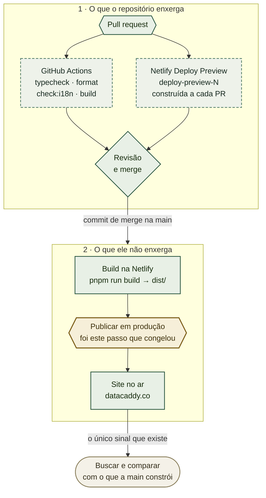

# Levar uma mudança ao `datacaddy.co` — e saber que ela chegou

> **Escrito em 14 de setembro de 2026, durante um congelamento de publicação ainda não resolvido.**
> Quatro merges para a `main` — pull requests
> [#21](https://github.com/ASO-DB-Solutions/site-datacaddy/pull/21),
> [#23](https://github.com/ASO-DB-Solutions/site-datacaddy/pull/23),
> [#24](https://github.com/ASO-DB-Solutions/site-datacaddy/pull/24) e
> [#25](https://github.com/ASO-DB-Solutions/site-datacaddy/pull/25) — não geraram nenhuma
> publicação em produção, enquanto a prévia de cada pull request foi construída e passou. Este guia
> existe porque essa situação ficou impossível de diagnosticar por horas, e por um único motivo:
> **nada no repositório informa se uma publicação aconteceu.**

Fazer merge não é publicar. São dois eventos, separados por minutos em um dia bom, e **nenhum sinal
liga um ao outro**. Tudo até o commit de merge é instrumentado — branch, revisão, CI, prévia.
Depois dele não há nada, e uma publicação congelada é idêntica a uma bem-sucedida.

## Onde isso se encaixa



As caixas tracejadas **barram, mas nunca publicam**. A caixa âmbar é onde a publicação acontece — e
onde ela parou: não emite status, não envia notificação e não escreve nada de volta no commit que a
disparou.

## Valores já conhecidos

| | |
|---|---|
| Branch de produção | `main` — nada mais publica |
| Comando de build | `pnpm run build`, diretório publicado `dist/` (do `netlify.toml`) |
| Endereço no ar | `https://datacaddy.co` |
| Endereço da prévia | `https://deploy-preview-<N>--datacaddy.netlify.app` — **só o Team Owner** no plano gratuito |
| Status de publicação no commit de merge | **Nenhum.** Verificado: o `d82c01a` publicou com sucesso e ainda reporta `state=pending, statuses=0` |

A última linha é o problema inteiro. Do repositório, um merge que publicou e um que não publicou
são indistinguíveis.

## Leia antes de começar: o que isto não resolve

**Nada aqui dispara nem destrava uma publicação em produção.** A conta da Netlify pertence ao dono
do site; este projeto não tem build hook, não tem CLI e não tem token. A única alavanca do
repositório é empurrar para a `main`, e se a publicação estiver bloqueada isso gera mais uma prévia
e nada além disso.

**Não faça merge de novo para "tentar outra vez".** Em 14 de setembro de 2026, quatro merges
entraram contra um publicador congelado. Cada um somou um commit, uma prévia e uma rodada de
confusão; nenhum mudou a produção. Se um merge não publicou, os próximos três também não vão.

## 1. Fazer o merge — este é todo o procedimento de publicação

Não existe passo de deploy. Fazer merge na `main` é a publicação. O `gh pr merge` falha com o token
restrito desta organização, então o merge é feito por SSH:

```bash
git checkout main && git pull --ff-only origin main
git merge --no-ff <branch> -m "Merge pull request #<N> from <branch>"
git push origin main

git branch -d <branch>
git push origin --delete <branch>
```

## 2. Conferir contra o site no ar — não contra o merge

O nome do arquivo do bundle carrega um hash do conteúdo, então muda sempre que o JavaScript muda.
É o sinal confiável mais barato:

```bash
curl -s https://datacaddy.co/ | grep -oE 'main-[A-Za-z0-9_-]+\.js' | head -1
ls dist/assets/main-*.js | xargs -n1 basename     # o que a main constrói agora
```

Dois nomes diferentes significam **não publicado**.

**Para uma mudança que toca só HTML, o sitemap ou `public/`, o hash do bundle não muda.** Confira a
superfície alterada em si, e prove que a resposta não veio de cache:

```bash
# o valor que você alterou
curl -s https://datacaddy.co/sitemap.xml | grep -c '<loc>'

# age: 0 significa que esta resposta veio da origem, não de um cache de borda
curl -sI https://datacaddy.co/pt-br/ | grep -iE '^age|^etag'
```

Um valor antigo com `age: 0` é conclusivo: a própria origem não mudou.

## 3. Se a produção não se moveu — OWNER

Tudo abaixo desta linha exige o painel da Netlify. Ninguém mais consegue ver, e a regra vigente é
que as configurações da Netlify são do dono.

Abra **Deploys**. A entrada mais recente responde em uma palavra:

| Se diz | O que aconteceu | O que resolve |
|---|---|---|
| **Failed** | O build quebrou | O log nomeia o erro; corrija no repositório |
| **Building** / **Queued** | Não há nada errado | Esperar |
| **Published**, mas o site está velho | Um deploy travado, ou o branch errado | **Unlock deploy**, ou conferir o branch de produção |
| **Auto publishing is off** | Os builds rodam, nada é servido | **Resume auto publishing** — um clique |

**O congelamento de 14 de setembro corresponde às duas últimas linhas.** As prévias foram
construídas e passaram em todos os pull requests, então a Netlify comprovadamente estava rodando
builds; só a produção parou. Isso descarta build quebrado, configuração errada do repositório,
minutos de build esgotados e webhook morto — todos derrubariam as prévias junto.

## 4. Ligar as notificações de publicação — OWNER, uma única vez

Esta é a correção duradoura, e é uma configuração em vez de acesso permanente para alguém:

**Netlify → o site → Notifications → Add notification → Deploy failed**, e de novo para **Deploy
succeeded**. Envie por e-mail, ou como **GitHub commit status**, que é melhor: o sinal passa a cair
no próprio commit, onde o repositório consegue vê-lo, e o problema central deste guia desaparece.

Até isso existir, toda publicação deste projeto é verificada por uma pessoa buscando o site à mão.

## Verificação

```bash
# 1. a main é o que você imagina
git fetch origin && git log --oneline -1 origin/main

# 2. o CI passou no commit de merge
gh api repos/ASO-DB-Solutions/site-datacaddy/commits/$(git rev-parse origin/main)/check-runs \
  --jq '.check_runs[] | "\(.status)/\(.conclusion)  \(.name)"'

# 3. o site no ar corresponde ao que a main constrói
curl -s https://datacaddy.co/ | grep -oE 'main-[A-Za-z0-9_-]+\.js' | head -1
ls dist/assets/main-*.js | xargs -n1 basename
```

O passo 2 informa o resultado do **GitHub Actions**, que barra o pull request. Ele não diz nada
sobre a Netlify ter publicado — é para isso que serve o passo 3, e por isso ele não pode ser
pulado.

## Solução de problemas

**O site não mudou, mas eu só editei HTML.** Esperado — o hash do bundle acompanha só o JavaScript.
Confira a superfície que você realmente alterou.

**O `gh pr checks` mostra `netlify/datacaddy/deploy-preview` passando, então a publicação
funcionou.** Não funcionou. Esse check reporta o build da **prévia** daquele pull request. Prévias
e produção são publicações separadas, e durante o congelamento de 14 de setembro as prévias
passaram continuamente enquanto a produção servia um build de três dias antes.

**Query string não fura o cache.** A Netlify normaliza query strings para arquivos estáticos:
`?cb=123` devolve o mesmo objeto em cache, com o mesmo `etag`. Envie `Cache-Control: no-cache` e
leia o cabeçalho `age`.

**O status do commit de merge fica `pending` para sempre.** Normal, e sem significado. A Netlify
não publica status ali — publicações bem-sucedidas se parecem exatamente com isso.

**O `gh pr create` falha com `unknown arguments`.** Um corpo com chaves, aspas ou `$` não sobrevive
ao escape do shell. Escreva em um arquivo e use `--body-file`.

## Relação com os outros guias

- O [`NETLIFY-SETUP.pt-BR.md`](NETLIFY-SETUP.pt-BR.md) coloca o site no ar: a conta, a importação
  do repositório, os parâmetros de DNS e o certificado. É um procedimento de uma vez só; este guia
  é o que acontece todos os dias depois.
- O [`NETLIFY-FORMS-SETUP.pt-BR.md`](NETLIFY-FORMS-SETUP.pt-BR.md) cobre as configurações do
  formulário de contato na Netlify, independentes da publicação.
- O [`ADR-0003`](adr/0003-netlify-hosts-the-site-with-netlify-forms-for-contact.md) registra por
  que Netlify Free, e as consequências desse plano — entre elas as prévias privadas, que é o
  motivo de o endereço da prévia não servir para conferir uma publicação.
- O `.github/workflows/ci.yml` só barra pull requests. Ele nunca publica, de propósito, para que a
  política de actions permitidas da organização nunca fique no caminho da publicação.

---

**Edição em inglês:** [`DEPLOYS.md`](DEPLOYS.md). As duas se mantêm em sincronia nas seções e nos
valores literais.
