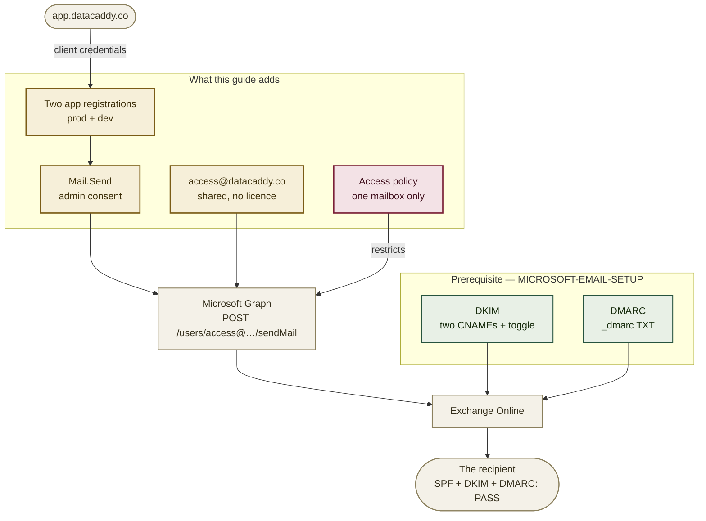

# Sending as `access@datacaddy.co`: app registrations, Mail.Send, and the policy that must not be skipped

> **Not done — this is the work outstanding.** Nothing below exists yet. `app.datacaddy.co` needs to send account mail (password and access messages) through Microsoft Graph, and none of the four pieces is in place: the app registrations, the admin consent, the sender mailbox, or the access policy that keeps the app from sending as anyone else. Update this banner when all four are done.

This is the **application** half of the domain's mail. [`MICROSOFT-EMAIL-SETUP.md`](MICROSOFT-EMAIL-SETUP.md)
covers the human half — `info@datacaddy.co`, a mailbox a person reads and replies from. This guide
covers mail that `app.datacaddy.co` sends on its own, with no person involved.

The two share a domain and therefore share a reputation. A badly configured application sender
damages the deliverability of the address a prospect writes to, which is why the DKIM and DMARC
work in the other guide is a **prerequisite here, not a parallel task**.

## Where this fits



**Order matters.** The mailbox (step 2) comes before consent (step 3) so that the access policy
(step 4) can name it the moment consent lands. Between granting consent and applying the policy
the application can send as **any mailbox in the tenant**, including `mar.ats@asodb.com.br` — so
those two steps belong in the same sitting, not on either side of a night.

## Already-known values

| Value | What it is |
|---|---|
| `dddcec62-0394-4988-a63c-c8156b2d7670` | Tenant ID, shared with `asodb.com.br` |
| `asodb1.onmicrosoft.com` | The tenant's initial domain — what `Connect-ExchangeOnline` takes |
| `datacaddy.co` | Verified, cloud-managed domain in the tenant. Already done |
| `access@datacaddy.co` | The sender this guide creates. Shared mailbox, no licence |
| `info@datacaddy.co` | The `Reply-To`. Created by [`MICROSOFT-EMAIL-SETUP.md`](MICROSOFT-EMAIL-SETUP.md) |
| `ecfa5fc3-fdf2-4673-989d-a6d05b96b518` | Application (client) ID — `asodb-datacaddy-mail`, production |
| `74dd37ac-52d8-4052-87e8-d5431d5f131a` | Application (client) ID — `asodb-datacaddy-mail-dev`, development |
| `2027-03-01` | Common secret expiry, matching the house convention |

**Why a separate registration rather than an existing one.** The tenant already holds app
registrations belonging to the Teams assistant — a different system, documented in the private
repository that owns it, with its own secret-rotation schedule. Sharing a registration across the
two means the day that rotation happens, DataCaddy's mail stops, and it stops *silently*: a
rejected token surfaces as mail that is simply never sent, with no error on the page that
triggered it. Separate registrations cost nothing and fail independently.

Their identifiers are deliberately not reproduced here. `PUBLIC-SURFACE.md` rule 1 — a public
repository's documentation describes *that* repository — puts another system's operational detail
in the private repository that owns it.

## Every field this asks for

Nothing below has to be invented at the keyboard. Where a portal asks for a name, a description or
an alias, this is the value to type.

| Where | Field | Value |
|---|---|---|
| App registration, prod | Name | `asodb-datacaddy-mail` |
| | Application (client) ID | `ecfa5fc3-fdf2-4673-989d-a6d05b96b518` |
| | Supported account types | *Accounts in this organizational directory only (Single tenant)* |
| | Redirect URI | leave empty |
| | Notes (*Branding & properties*) | `Transactional sender for app.datacaddy.co. Sends only as access@datacaddy.co, enforced by an application access policy. See docs/GRAPH-MAIL-SETUP.md.` |
| App registration, dev | Name | `asodb-datacaddy-mail-dev` |
| | Application (client) ID | `74dd37ac-52d8-4052-87e8-d5431d5f131a` |
| | Owners | Yukio **and Guilherme** |
| | Notes | `Development sender for app.datacaddy.co. Same scope as production. Guilherme holds this registration's secret.` |
| Sender mailbox | Display name | `DataCaddy` |
| | Email / alias | `access@datacaddy.co` / `access` |
| | Hidden from address lists | **Yes** |
| Sender group *(option B only)* | Name | `DataCaddy Senders` |
| | Alias / address | `datacaddy-senders` / `datacaddy-senders@asodb.com.br` |
| | Type | Mail-enabled **security** group |
| Access policy, prod | `-Description` | `DataCaddy prod: send only as access@datacaddy.co` |
| Access policy, dev | `-Description` | `DataCaddy dev: send only as access@datacaddy.co` |
| Client secret, prod | Description | `asodb-datacaddy-mail-prod-2027-0301` |
| | Expires | **Custom** → `2027-03-01` |
| Client secret, dev | Description | `asodb-datacaddy-mail-dev-2027-0301` |
| | Expires | **Custom** → `2027-03-01` |

The display name is `DataCaddy` rather than something more specific because it is what a recipient
sees in the From line if the application ever omits `RemetenteNome`. Disambiguation in the admin
centre comes from the address, not the name — which is also why the mailbox is hidden from the
address lists: nobody should be able to pick it out of a people picker.

## Set these first

```bash
# already known -- see table above, included here for copy-paste convenience
export TENANT_ID="dddcec62-0394-4988-a63c-c8156b2d7670"
export TENANT_INITIAL="asodb1.onmicrosoft.com"
export SENDER="access@datacaddy.co"
export REPLY_TO="info@datacaddy.co"
```

## Read this before you start: what this can't do

- **It cannot be done from the repository.** Every step is in the Entra admin centre, the
  Microsoft 365 admin centre, or Exchange Online PowerShell. Nothing here changes with a deploy.
- **Steps 2, 3 and 4 need an administrator.** Step 1 does not — creating an app registration is
  within Yukio's existing rights, and the registrations he already owns in this tenant are the
  proof.
- **No secret value appears in this document, and none should ever travel.** The rule is the
  house rule: *whoever generates a secret is the one who pastes it into its destination.* Not over
  Teams, not over e-mail, not in a ticket, not in a file. This is step 5.
- **It cannot make mail trustworthy on its own.** Without DKIM signing, application mail from
  `datacaddy.co` is authenticated by SPF alone and breaks on forwarding. Finish
  [`MICROSOFT-EMAIL-SETUP.md`](MICROSOFT-EMAIL-SETUP.md) first.

## 1. Create the two app registrations — NOT ADMIN

> **Done and verified in the portal on 2026-09-15.** Both registrations exist with the IDs in the
> table above, both are *My organization only*, and ownership is correct: `-dev` has Yukio and
> Guilherme, production has Yukio alone. **`Mail.Send` is declared on both as an Application
> permission**, showing *Admin consent required: Yes* and not yet granted — which is the correct
> resting state going into step 3. Neither holds a secret yet; that is step 5.
>
> Read the permission from **API permissions**, not from **Overview** — the Overview blade does not
> show API permissions at all, so an app can look bare there while being fully configured.

Entra admin centre → **App registrations** → **New registration**.

Create both, one at a time:

| Display name | Who owns it | Purpose |
|---|---|---|
| `asodb-datacaddy-mail` | Yukio | Production sender |
| `asodb-datacaddy-mail-dev` | Yukio **and Guilherme** | Development sender |

- **Supported account types:** *Accounts in this organizational directory only (Single tenant)*.
- **Redirect URI:** leave empty. Client credentials never redirect a browser anywhere, and the
  one flow that would have wanted a reply address was rejected in step 3.

Then on each: **API permissions** → **Add a permission** → **Microsoft Graph** →
**Application permissions** → **Mail.Send**. Add it and stop — granting is step 3.

**Add Guilherme as an owner of `asodb-datacaddy-mail-dev`:** the registration's **Owners** blade →
**Add owners**. This is the step that makes step 5 possible without a secret changing hands: an
owner can issue credentials on his own registration, so he generates his own value and pastes it
straight into his own `appsettings`.

Record both **Application (client) ID** values. They are identifiers, not secrets — they can be
sent over chat.

## 2. Create the sender mailbox — ADMIN

**[admin.microsoft.com](https://admin.microsoft.com)** → **Teams & groups** →
**Shared mailboxes** → **Add a shared mailbox**. Values are in
[Every field this asks for](#every-field-this-asks-for).

A shared mailbox needs **no licence** and can be sent as by an application, which is exactly the
shape required. No members are needed — nobody reads this mailbox.

Then hide it, so it cannot be chosen by a person composing a message:

```powershell
Connect-ExchangeOnline -Organization asodb1.onmicrosoft.com
Set-Mailbox access@datacaddy.co -HiddenFromAddressListsEnabled $true
```

**The sender has to be a mailbox.** Graph sends with `POST /users/{id}/sendMail`, and the `{id}` it
resolves must own a mailbox. A distribution group has no mailbox and cannot be a sender, which is
why this step creates one rather than reusing an existing address.

**`info@datacaddy.co` is a group, and that is fine here** — it is this guide's `Reply-To`, not its
sender, so a reply fans out to everyone in it. What it must *not* become is a member of the sender
group in option B of step 4; that would let the application send **as** `info@`, which is the one
address a customer trusts a human to be behind.

**Why a second address rather than sending as `info@`.** `info@` is where a prospect writes and a
person answers. Mixing automated account mail into it fills a human inbox with machine traffic and
couples the product's sending reputation to the company's contact address. Two addresses, two jobs.

## 3. Grant admin consent for Mail.Send — ADMIN

Application permissions do nothing until an administrator consents. Until this step the app holds
a permission it cannot use, and every `sendMail` call returns `403`. Whoever creates the
registration cannot consent for it — that is the separation of duty, not a misconfiguration.

**Consenting is a directory role, not app ownership.** The administrator does *not* need to be an
owner of these registrations, and should not be added as one: ownership grants credential
management, which is a different power and unnecessary here. Production deliberately has a single
owner.

### Use the portal button

Entra admin centre → **App registrations** → the registration → **API permissions** →
**Grant admin consent for ASO DB Solutions**. Do it for **both** registrations.

The **Status** column must then read *Granted for ASO DB Solutions* with a green check; anything
else means it did not take.

This is the recommended route because it completes in the portal and shows its own result. Nothing
redirects, so none of the failure modes below apply.

### The `/adminconsent` links, and why they are the second choice

| Registration | Admin consent URL |
|---|---|
| `asodb-datacaddy-mail` | `https://login.microsoftonline.com/dddcec62-0394-4988-a63c-c8156b2d7670/adminconsent?client_id=ecfa5fc3-fdf2-4673-989d-a6d05b96b518` |
| `asodb-datacaddy-mail-dev` | `https://login.microsoftonline.com/dddcec62-0394-4988-a63c-c8156b2d7670/adminconsent?client_id=74dd37ac-52d8-4052-87e8-d5431d5f131a` |

They are genuinely convenient — one click lands on the approval screen with no navigation, which
suits an administrator working from a phone. The catch is what happens *after* approval. The
endpoint redirects, and these are daemon applications with no reply address, so the approval lands
and the redirect then fails with **`AADSTS500113: No reply address is registered for the
application`**.

Registering `https://login.microsoftonline.com/common/oauth2/nativeclient` to catch that redirect was tried and **rejected on 2026-09-15**: navigating
there shows Microsoft's own warning that the page *"could be a sign of a phishing attempt"*. It is
a legitimate Microsoft endpoint and the warning is generic, but an administrator who is asked to
approve an application permission and then lands on a phishing notice has been given every reason
to distrust the request. A plain error is better than a false alarm.

**So if the links are used, say in advance that the error is expected** — and verify either way.

### Verify the grant rather than trusting the screen

Entra admin centre → **Enterprise applications** → the application → **Permissions**. `Mail.Send`
listed under admin consent means it took, whichever route was used.

> **Then go straight to step 4.** With consent granted and no access policy in place,
> `Mail.Send` means *send as any mailbox in the tenant* — every user, every shared mailbox,
> including the owner's. That is the widest the application will ever be, and it is the state it
> sits in between these two steps.

## 4. Restrict which mailbox the app can send as — ADMIN

This is the step that turns a tenant-wide permission into a scoped one. **It is not optional.**

`-PolicyScopeGroupId` accepts either a single **mailbox** or a mail-enabled **security group**.
Both are correct and enforce identically; the choice is about what happens the next time a sender
is added.

| | Option A — mailbox | Option B — security group |
|---|---|---|
| Scope | Exactly `access@datacaddy.co` | Whoever is in the group |
| Adding a second sender later | A second policy per app, or replace this one | Add a member; the policy is untouched |
| Choose when | One sender, and it stays one | A billing, alerts or notifications address is plausible |

**Option A — a single mailbox**

```powershell
Connect-ExchangeOnline -Organization asodb1.onmicrosoft.com

New-ApplicationAccessPolicy `
  -AppId "ecfa5fc3-fdf2-4673-989d-a6d05b96b518" `
  -PolicyScopeGroupId "access@datacaddy.co" `
  -AccessRight RestrictAccess `
  -Description "DataCaddy prod: send only as access@datacaddy.co"
```

**Option B — a mail-enabled security group**

```powershell
New-DistributionGroup `
  -Name "DataCaddy Senders" `
  -Alias "datacaddy-senders" `
  -PrimarySmtpAddress "datacaddy-senders@asodb.com.br" `
  -Type Security `
  -Members "access@datacaddy.co"

New-ApplicationAccessPolicy `
  -AppId "ecfa5fc3-fdf2-4673-989d-a6d05b96b518" `
  -PolicyScopeGroupId "datacaddy-senders@asodb.com.br" `
  -AccessRight RestrictAccess `
  -Description "DataCaddy prod: send only as the DataCaddy Senders group"
```

It has to be a mail-enabled **security** group — `-Type Security`. A Microsoft 365 group or a plain
distribution list is not accepted as a policy scope. Whoever is in the group is a mailbox the
application may send as, so the membership list *is* the permission: review it the way you would
review the policy.

**Run this once per registration**, production and dev, whichever option you take. `RestrictAccess`
is an allow-list: the application may act on the named scope and **nothing else**. The policy is
evaluated per request, so it applies to tokens already issued.

Exchange Online also offers **RBAC for Applications** as a newer route to the same control. Either
is acceptable; what is not acceptable is neither.

## 5. Issue the secrets — each holder issues their own

| Registration | Secret description | Expires | Who creates it |
|---|---|---|---|
| `asodb-datacaddy-mail` | `asodb-datacaddy-mail-prod-2027-0301` | `2027-03-01` | Yukio |
| `asodb-datacaddy-mail-dev` | `asodb-datacaddy-mail-dev-2027-0301` | `2027-03-01` | Guilherme |

### How the developer issues his own — no admin rights needed

This is the mechanism that keeps the house rule intact. It works because **an owner of an app
registration can manage that registration's credentials**, which is a property of ownership, not a
directory role. Guilherme never needs to be an administrator, and nobody ever sends him a secret.

1. Yukio adds him as an owner in step 1 — the registration's **Owners** blade → **Add owners**.
2. He signs in to **[entra.microsoft.com](https://entra.microsoft.com)** with his
   `@asodb.com.br` account.
3. **App registrations** → the **Owned applications** tab. `asodb-datacaddy-mail-dev` is there;
   the production one is not, and should not be.
4. **Certificates & secrets** → **+ New client secret**.
   Description `asodb-datacaddy-mail-dev-2027-0301`, **Expires: Custom** → `2027-03-01` → **Add**.
5. He copies the **Value** column immediately — it is shown once, and no permission level recovers
   it afterwards — and pastes it straight into his own configuration.

> **If step 3 of that list shows him nothing**, the tenant has *Restrict access to Microsoft Entra
> ID administration portal* set to **Yes** — the Owners blade warns about this in the portal
> itself. It blocks non-admin owners from the **portal**, not from the API, so ownership still
> authorises the credential; he just cannot use the browser to exercise it.
>
> The fallback needs no admin and no policy change:
>
> ```bash
> az login --tenant dddcec62-0394-4988-a63c-c8156b2d7670
> az ad app credential reset \
>   --id 74dd37ac-52d8-4052-87e8-d5431d5f131a \
>   --display-name "asodb-datacaddy-mail-dev-2027-0301" \
>   --end-date 2027-03-01 \
>   --append \
>   --query password -o tsv
> ```
>
> **`--append` is not optional.** Without it the command *deletes every existing secret* on that
> registration. Harmless today, because there is none — but the habit is what matters, and the
> house runbook records what omitting it cost once already.

**Where he pastes it.** Not into `appsettings.json`, which is tracked. .NET's Secret Manager keeps
it outside the repository entirely, which is what a developer secret wants:

```bash
dotnet user-secrets init
dotnet user-secrets set "GraphEmailSettings:ClientSecret" "<paste>"
```

The value then lives in the user profile, not the working tree, and cannot be committed by
accident. In production the same key comes from the deployment's secret store, never from a file.

If step 4 has not been done yet, the secret still works — and the application can send as any
mailbox in the tenant. That is the whole reason step 4 does not wait.

**What the application consumes**, for reference — the value column is filled in by whoever holds
the secret, not by whoever wrote this file:

```jsonc
"GraphEmailSettings": {
  "TenantId":       "dddcec62-0394-4988-a63c-c8156b2d7670",
  "ClientId":       "74dd37ac-52d8-4052-87e8-d5431d5f131a",
  "ClientSecret":   "<issued in step 5, pasted by its holder>",
  "RemetenteEmail": "access@datacaddy.co",
  "RemetenteNome":  "DataCaddy",
  "ReplyTo":        "info@datacaddy.co",
  "Habilitado":     true
}
```

The expiry date is carried in the secret's name because the expiry *field* is only visible to
someone already looking at that credential in that console. A name that carries the date can be
inventoried from a list.

## Verify

```powershell
# 1. The policy grants the sender -- and denies everything else.
#    The second command is the one that matters; a policy that grants but does not
#    deny is a policy that was never applied.
Test-ApplicationAccessPolicy -Identity access@datacaddy.co   -AppId "ecfa5fc3-fdf2-4673-989d-a6d05b96b518"   # Granted
Test-ApplicationAccessPolicy -Identity info@datacaddy.co     -AppId "ecfa5fc3-fdf2-4673-989d-a6d05b96b518"   # Denied
Test-ApplicationAccessPolicy -Identity mar.ats@asodb.com.br  -AppId "ecfa5fc3-fdf2-4673-989d-a6d05b96b518"   # Denied
```

```bash
# 2. A token is issued and carries Mail.Send.
#    Paste the secret into the prompt -- do not put it in the command line,
#    where it would be written to shell history.
read -rsp "client secret: " SECRET && echo
curl -s -X POST "https://login.microsoftonline.com/$TENANT_ID/oauth2/v2.0/token" \
  -d "client_id=ecfa5fc3-fdf2-4673-989d-a6d05b96b518" \
  -d "scope=https://graph.microsoft.com/.default" \
  -d "client_secret=$SECRET" \
  -d "grant_type=client_credentials" \
  | python3 -c "import sys,json,base64; t=json.load(sys.stdin)['access_token']; p=t.split('.')[1]; print(json.loads(base64.urlsafe_b64decode(p+'='*(-len(p)%4)))['roles'])"
# expected: ['Mail.Send']
unset SECRET
```

```
# 3. The real test: have the application send one message to a Gmail address,
#    open it, and use "Show original". All three must read PASS:
#      SPF: PASS   DKIM: PASS   DMARC: PASS
#    Then confirm the From reads access@datacaddy.co and Reply-To reads info@datacaddy.co.
```

Step 3 is the one that matters. The first two prove the plumbing; only a delivered message proves
the chain works end to end — and only step 3 catches a `ReplyTo` that was configured but never
actually set on the outgoing message.

## Troubleshooting

**`sendMail` returns `403 Forbidden` with `ErrorAccessDenied`.** Either admin consent was never
granted (step 3), or the access policy denies this mailbox (step 4). `Test-ApplicationAccessPolicy`
separates the two: if it says *Denied* for `access@datacaddy.co`, the policy is wrong; if it says
*Granted* and the call still fails, consent is missing.

**`sendMail` returns `401 Unauthorized`.** The secret is wrong, expired, or belongs to the other
registration. Check the expiry in **Certificates & secrets** before assuming a typo — a secret that
worked yesterday and fails today has usually expired.

**The token comes back but `roles` is absent.** `Mail.Send` was added as a *Delegated* permission
rather than an *Application* one. Delegated permissions need a signed-in user and are never
present in a client-credentials token. Remove it and re-add under **Application permissions**.

**`New-ApplicationAccessPolicy` reports the app was not found.** `-AppId` takes the
**Application (client) ID**, not the object ID and not the display name.

**Mail sends successfully but lands in spam.** DKIM is not signing. Check `DKIM: PASS` in a
received message's original; if it reads `none`, finish step 1 of
[`MICROSOFT-EMAIL-SETUP.md`](MICROSOFT-EMAIL-SETUP.md).

**The Add-a-permission panel shows `Mail.Send` ticked and both buttons greyed out.** Nothing is
wrong: the permission is already on the registration, the panel pre-ticks what is there, and with
no pending change there is nothing to update and nothing to discard. Close it with the **✕**. The
**API permissions** table is what to read, and the **Type** column is the field that matters —
`Application`, never `Delegated`.

**Everything works in dev and fails in production.** The two registrations are separate on purpose
and each needs its own consent and its own access policy. Steps 3 and 4 are per-registration.

## Relationship to the other guides

- [`MICROSOFT-EMAIL-SETUP.md`](MICROSOFT-EMAIL-SETUP.md) is the prerequisite: DKIM and DMARC for
  `datacaddy.co`, plus `info@datacaddy.co`, which is this guide's `Reply-To`. Do it first.
- [`NETLIFY-FORMS-SETUP.md`](NETLIFY-FORMS-SETUP.md) covers the contact form's notifications.
  Unrelated path — Netlify sends that mail, not Microsoft — but it shares the destination mailbox.
- [`PUBLIC-SURFACE.md`](PUBLIC-SURFACE.md) covers what the public can infer from published
  records. Application IDs are identifiers and safe to publish; secrets are not.

---

**pt-BR edition:** [`GRAPH-MAIL-SETUP.pt-BR.md`](GRAPH-MAIL-SETUP.pt-BR.md). Both stay in step on
sections and literal values.
