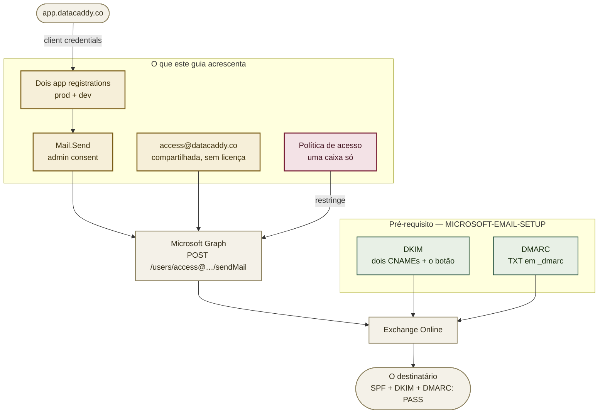

# Enviando como `access@datacaddy.co`: app registrations, Mail.Send e a política que não dá para pular

> **Pendente — este é o trabalho a ser feito.** Nada do que está abaixo existe ainda. O `app.datacaddy.co` precisa enviar e-mail de conta (mensagens de senha e de acesso) pelo Microsoft Graph, e nenhuma das quatro peças está no lugar: os app registrations, o admin consent, a caixa remetente e a política de acesso que impede o app de enviar como qualquer outra pessoa. Atualize este aviso quando as quatro estiverem prontas.

Esta é a metade **aplicação** do e-mail do domínio. O
[`MICROSOFT-EMAIL-SETUP.pt-BR.md`](MICROSOFT-EMAIL-SETUP.pt-BR.md) cobre a metade humana —
`info@datacaddy.co`, uma caixa que uma pessoa lê e de onde responde. Este guia cobre o e-mail que
o `app.datacaddy.co` envia sozinho, sem pessoa nenhuma no meio.

Os dois compartilham um domínio e, portanto, compartilham uma reputação. Um remetente de aplicação
mal configurado estraga a entregabilidade do endereço para onde um prospect escreve — e é por isso
que o DKIM e o DMARC do outro guia são **pré-requisito aqui, não tarefa paralela**.

## Onde isso se encaixa



**A ordem importa.** A caixa (passo 2) vem antes do consent (passo 3) para que a política de acesso
(passo 4) consiga nomeá-la no instante em que o consent cai. Entre conceder o consent e aplicar a
política, a aplicação consegue enviar como **qualquer caixa do tenant**, inclusive
`mar.ats@asodb.com.br` — então esses dois passos ficam na mesma sentada, não um de cada lado de
uma noite.

## Valores já conhecidos

| Valor | O que é |
|---|---|
| `dddcec62-0394-4988-a63c-c8156b2d7670` | Tenant ID, o mesmo do `asodb.com.br` |
| `asodb1.onmicrosoft.com` | Domínio inicial do tenant — o que o `Connect-ExchangeOnline` recebe |
| `datacaddy.co` | Domínio verificado e gerenciado na nuvem, no tenant. Já feito |
| `access@datacaddy.co` | O remetente que este guia cria. Caixa compartilhada, sem licença |
| `info@datacaddy.co` | O `Reply-To`. Criado pelo [`MICROSOFT-EMAIL-SETUP.pt-BR.md`](MICROSOFT-EMAIL-SETUP.pt-BR.md) |
| `ecfa5fc3-fdf2-4673-989d-a6d05b96b518` | Application (client) ID — `asodb-datacaddy-mail`, produção |
| `74dd37ac-52d8-4052-87e8-d5431d5f131a` | Application (client) ID — `asodb-datacaddy-mail-dev`, desenvolvimento |
| `2027-03-01` | Expiração comum dos segredos, seguindo a convenção da casa |

**Por que um registration separado, e não um que já existe.** O tenant já tem app registrations
do assistente do Teams — outro sistema, documentado no repositório privado que o possui, com
calendário próprio de rotação de segredo. Compartilhar um registration entre os dois significa
que, no dia dessa rotação, o e-mail do DataCaddy para — e para *em silêncio*: um token recusado
aparece como mensagem que simplesmente nunca foi enviada, sem erro nenhum na tela que a disparou.
Registrations separados não custam nada e falham de forma independente.

Os identificadores deles não são reproduzidos aqui de propósito. A regra 1 do
`PUBLIC-SURFACE.pt-BR.md` — a documentação de um repositório público descreve *aquele* repositório
— coloca detalhe operacional de outro sistema no repositório privado que o possui.

## Todos os campos que serão pedidos

Nada abaixo precisa ser inventado na hora. Onde um portal pedir um nome, uma description ou um
alias, este é o valor a digitar.

**Os valores literais estão em inglês de propósito, e assim ficam.** Duas razões: as duas edições
deste guia precisam produzir exatamente os mesmos objetos no tenant — se cada leitor digitasse na
própria língua, o `Get-ApplicationAccessPolicy` devolveria descrições diferentes para a mesma
política — e o público do DataCaddy é os Estados Unidos, então o endereço remetente que o cliente
vê é `access@`, não `acesso@`. Traduzir qualquer valor desta tabela quebra as duas coisas.

| Onde | Campo | Valor |
|---|---|---|
| App registration, prod | Name | `asodb-datacaddy-mail` |
| | Application (client) ID | `ecfa5fc3-fdf2-4673-989d-a6d05b96b518` |
| | Supported account types | *Accounts in this organizational directory only (Single tenant)* |
| | Redirect URI | deixar vazio |
| | Notes (*Branding & properties*) | `Transactional sender for app.datacaddy.co. Sends only as access@datacaddy.co, enforced by an application access policy. See docs/GRAPH-MAIL-SETUP.md.` |
| App registration, dev | Name | `asodb-datacaddy-mail-dev` |
| | Application (client) ID | `74dd37ac-52d8-4052-87e8-d5431d5f131a` |
| | Owners | Yukio **e Guilherme** |
| | Notes | `Development sender for app.datacaddy.co. Same scope as production. Guilherme holds this registration's secret.` |
| Caixa remetente | Display name | `DataCaddy` |
| | E-mail / alias | `access@datacaddy.co` / `access` |
| | Oculta nas listas de endereços | **Sim** |
| Grupo remetente *(só na opção B)* | Name | `DataCaddy Senders` |
| | Alias / endereço | `datacaddy-senders` / `datacaddy-senders@asodb.com.br` |
| | Tipo | Grupo de **segurança** habilitado para e-mail |
| Política de acesso, prod | `-Description` | `DataCaddy prod: send only as access@datacaddy.co` |
| Política de acesso, dev | `-Description` | `DataCaddy dev: send only as access@datacaddy.co` |
| Client secret, prod | Description | `asodb-datacaddy-mail-prod-2027-0301` |
| | Expires | **Custom** → `2027-03-01` |
| Client secret, dev | Description | `asodb-datacaddy-mail-dev-2027-0301` |
| | Expires | **Custom** → `2027-03-01` |

O display name é `DataCaddy`, e não algo mais específico, porque é o que o destinatário vê na
linha From se a aplicação algum dia omitir o `RemetenteNome`. A desambiguação no admin center vem
do endereço, não do nome — que é também o motivo de a caixa ficar oculta nas listas de endereços:
ninguém deveria conseguir escolhê-la num seletor de pessoas.

## Defina isto primeiro

```bash
# já conhecidos -- ver tabela acima, incluídos aqui para copiar e colar
export TENANT_ID="dddcec62-0394-4988-a63c-c8156b2d7670"
export TENANT_INITIAL="asodb1.onmicrosoft.com"
export SENDER="access@datacaddy.co"
export REPLY_TO="info@datacaddy.co"
```

## Leia antes de começar: o que este guia não faz

- **Não dá para fazer pelo repositório.** Cada passo está no Entra admin center, no admin center do
  Microsoft 365 ou no Exchange Online PowerShell. Nada aqui muda com um deploy.
- **Os passos 2, 3 e 4 exigem administrador.** O passo 1 não — criar app registration está dentro
  dos direitos que o Yukio já tem, e os registrations que ele já possui neste tenant são a prova.
- **Nenhum valor de segredo aparece neste documento, e nenhum deve circular.** A regra é a regra da
  casa: *quem gera um segredo é quem cola esse segredo no destino.* Nem por Teams, nem por e-mail,
  nem em chamado, nem em arquivo. É o passo 5.
- **Isto sozinho não torna o e-mail confiável.** Sem assinatura DKIM, o e-mail de aplicação saindo
  de `datacaddy.co` é autenticado só por SPF e quebra quando encaminhado. Conclua antes o
  [`MICROSOFT-EMAIL-SETUP.pt-BR.md`](MICROSOFT-EMAIL-SETUP.pt-BR.md).

## 1. Criar os dois app registrations — NÃO É ADMIN

> **Feito e conferido no portal em 2026-09-15.** Os dois registrations existem com os IDs da
> tabela acima, os dois são *My organization only*, e a posse está certa: o `-dev` tem Yukio e
> Guilherme, o de produção só o Yukio. **O `Mail.Send` está declarado nos dois como permissão de
> aplicação**, com *Admin consent required: Yes* e ainda não concedido — que é o estado correto
> para entrar no passo 3. Nenhum dos dois tem segredo ainda; isso é o passo 5.
>
> Conferir a permissão em **API permissions**, não no **Overview** — a aba Overview não mostra API
> permissions nenhuma, então um app pode parecer vazio ali estando totalmente configurado.

Entra admin center → **App registrations** → **New registration**.

Criar os dois, um de cada vez:

| Display name | Quem é owner | Finalidade |
|---|---|---|
| `asodb-datacaddy-mail` | Yukio | Remetente de produção |
| `asodb-datacaddy-mail-dev` | Yukio **e Guilherme** | Remetente de desenvolvimento |

- **Supported account types:** *Accounts in this organizational directory only (Single tenant)*.
- **Redirect URI:** deixar vazio. Client credentials nunca redireciona navegador, e o único fluxo
  que iria querer um reply address foi descartado no passo 3.

Depois, em cada um: **API permissions** → **Add a permission** → **Microsoft Graph** →
**Application permissions** → **Mail.Send**. Adicionar e parar — conceder é o passo 3.

**Adicionar o Guilherme como owner do `asodb-datacaddy-mail-dev`:** aba **Owners** do registration
→ **Add owners**. É este passo que torna o passo 5 possível sem segredo trocando de mão: um owner
emite credencial no próprio registration, então ele gera o próprio valor e cola direto no
`appsettings` dele.

Anotar os dois **Application (client) ID**. São identificadores, não segredos — podem ir por chat.

## 2. Criar a caixa remetente — ADMIN

**[admin.microsoft.com](https://admin.microsoft.com)** → **Teams & groups** →
**Shared mailboxes** → **Add a shared mailbox**. Os valores estão em
[Todos os campos que serão pedidos](#todos-os-campos-que-serão-pedidos).

Caixa compartilhada **não consome licença** e pode ser usada como remetente por uma aplicação, que
é exatamente o formato necessário. Não precisa de membros — ninguém lê esta caixa.

Depois, ocultá-la, para que não possa ser escolhida por uma pessoa escrevendo uma mensagem:

```powershell
Connect-ExchangeOnline -Organization asodb1.onmicrosoft.com
Set-Mailbox access@datacaddy.co -HiddenFromAddressListsEnabled $true
```

**O remetente precisa ser uma caixa.** O Graph envia com `POST /users/{id}/sendMail`, e o `{id}`
que ele resolve precisa ter caixa. Grupo de distribuição não tem caixa e não pode ser remetente —
por isso este passo cria uma em vez de reaproveitar um endereço existente.

**O `info@datacaddy.co` é um grupo, e aqui isso não é problema** — ele é o `Reply-To` deste guia,
não o remetente, então a resposta se espalha para todo mundo que está nele. O que ele **não** pode
virar é membro do grupo remetente da opção B do passo 4; isso deixaria a aplicação enviar **como**
`info@`, que é justamente o endereço onde o cliente confia haver uma pessoa.

**Por que um segundo endereço em vez de enviar como `info@`.** O `info@` é onde um prospect
escreve e uma pessoa responde. Misturar e-mail automático de conta ali enche uma caixa humana de
tráfego de máquina e acopla a reputação de envio do produto ao endereço de contato da empresa.
Dois endereços, dois trabalhos.

## 3. Conceder admin consent do Mail.Send — ADMIN

Permissão de aplicação não faz nada até um administrador consentir. Até este passo o app tem uma
permissão que não consegue usar, e toda chamada de `sendMail` devolve `403`. Quem cria o
registration não consegue consentir por ele — isso é separação de responsabilidade, não defeito de
configuração.

**Consentir é papel de diretório, não posse do app.** O administrador **não** precisa ser owner
destes registrations, e não deve ser adicionado como tal: posse dá administração de credencial,
que é outro poder e desnecessário aqui. O de produção tem um owner só, de propósito.

### Usar o botão do portal

Entra admin center → **App registrations** → o registration → **API permissions** →
**Grant admin consent for ASO DB Solutions**. Nos **dois** registrations.

A coluna **Status** precisa então dizer *Granted for ASO DB Solutions* com o check verde; qualquer
outra coisa significa que não pegou.

É a rota recomendada porque termina no portal e mostra o próprio resultado. Nada redireciona, então
nenhuma das falhas abaixo se aplica.

### Os links de `/adminconsent`, e por que são a segunda opção

| Registration | URL de admin consent |
|---|---|
| `asodb-datacaddy-mail` | `https://login.microsoftonline.com/dddcec62-0394-4988-a63c-c8156b2d7670/adminconsent?client_id=ecfa5fc3-fdf2-4673-989d-a6d05b96b518` |
| `asodb-datacaddy-mail-dev` | `https://login.microsoftonline.com/dddcec62-0394-4988-a63c-c8156b2d7670/adminconsent?client_id=74dd37ac-52d8-4052-87e8-d5431d5f131a` |

São realmente convenientes — um clique cai na tela de aprovação sem navegação nenhuma, o que serve
a um administrador trabalhando pelo celular. O problema é o que acontece *depois* da aprovação. O
endpoint redireciona, e estas são aplicações daemon sem reply address, então a aprovação entra e o
redirect falha com **`AADSTS500113: No reply address is registered for the application`**.

Registrar o `https://login.microsoftonline.com/common/oauth2/nativeclient` para receber esse redirect foi testado e **descartado em 2026-09-15**: ao abri-lo
aparece o aviso da própria Microsoft de que a página *"could be a sign of a phishing attempt"*. É
endpoint legítimo da Microsoft e o aviso é genérico, mas um administrador a quem se pede aprovação
de permissão de aplicação e que em seguida cai num aviso de phishing recebeu todos os motivos para
desconfiar do pedido. Erro simples é melhor que alarme falso.

**Então, se usar os links, avisar antes que o erro é esperado** — e conferir de todo jeito.

### Conferir a concessão em vez de confiar na tela

Entra admin center → **Enterprise applications** → a aplicação → **Permissions**. `Mail.Send`
listado sob admin consent significa que pegou, seja qual for a rota.

> **Depois disso, ir direto para o passo 4.** Com o consent concedido e sem política de acesso,
> `Mail.Send` significa *enviar como qualquer caixa do tenant* — todo usuário, toda caixa
> compartilhada, inclusive a do owner. É o estado mais amplo em que a aplicação vai existir, e é
> nele que ela fica entre esses dois passos.

## 4. Restringir de qual caixa o app pode enviar — ADMIN

É o passo que transforma uma permissão de tenant inteiro em permissão com escopo. **Não é
opcional.**

O `-PolicyScopeGroupId` aceita uma **caixa** única ou um **grupo de segurança** habilitado para
e-mail. Os dois estão corretos e garantem a mesma coisa; a escolha é sobre o que acontece na
próxima vez que um remetente for acrescentado.

| | Opção A — caixa | Opção B — grupo de segurança |
|---|---|---|
| Escopo | Exatamente `access@datacaddy.co` | Quem estiver no grupo |
| Acrescentar um segundo remetente depois | Outra política por app, ou substituir esta | Adicionar um membro; a política não é tocada |
| Escolher quando | Um remetente, e vai continuar um | Um endereço de cobrança, alerta ou notificação é plausível |

**Opção A — uma caixa única**

```powershell
Connect-ExchangeOnline -Organization asodb1.onmicrosoft.com

New-ApplicationAccessPolicy `
  -AppId "ecfa5fc3-fdf2-4673-989d-a6d05b96b518" `
  -PolicyScopeGroupId "access@datacaddy.co" `
  -AccessRight RestrictAccess `
  -Description "DataCaddy prod: send only as access@datacaddy.co"
```

**Opção B — um grupo de segurança habilitado para e-mail**

```powershell
New-DistributionGroup `
  -Name "DataCaddy Senders" `
  -Alias "datacaddy-senders" `
  -PrimarySmtpAddress "datacaddy-senders@asodb.com.br" `
  -Type Security `
  -Members "access@datacaddy.co"

New-ApplicationAccessPolicy `
  -AppId "ecfa5fc3-fdf2-4673-989d-a6d05b96b518" `
  -PolicyScopeGroupId "datacaddy-senders@asodb.com.br" `
  -AccessRight RestrictAccess `
  -Description "DataCaddy prod: send only as the DataCaddy Senders group"
```

Precisa ser grupo de **segurança** habilitado para e-mail — `-Type Security`. Grupo do Microsoft
365 ou lista de distribuição comum não é aceito como escopo de política. Quem está no grupo é uma
caixa da qual a aplicação pode enviar, então a lista de membros **é** a permissão: revise-a como
revisaria a política.

**Rodar uma vez por registration**, produção e dev, seja qual for a opção. `RestrictAccess` é lista
de permissão: a aplicação age sobre o escopo nomeado e **nada além**. É avaliada por requisição,
então vale também para tokens já emitidos.

O Exchange Online também oferece o **RBAC for Applications** como caminho mais novo para o mesmo
controle. Qualquer um dos dois serve; o que não serve é nenhum.

## 5. Emitir os segredos — cada um emite o seu

| Registration | Description do segredo | Expira | Quem cria |
|---|---|---|---|
| `asodb-datacaddy-mail` | `asodb-datacaddy-mail-prod-2027-0301` | `2027-03-01` | Yukio |
| `asodb-datacaddy-mail-dev` | `asodb-datacaddy-mail-dev-2027-0301` | `2027-03-01` | Guilherme |

### Como o desenvolvedor emite o dele — sem direito de admin

É este o mecanismo que mantém a regra da casa de pé. Funciona porque **quem é owner de um app
registration administra as credenciais daquele registration** — é propriedade da posse, não papel
de diretório. O Guilherme nunca precisa ser administrador, e ninguém nunca lhe envia um segredo.

1. O Yukio o adiciona como owner no passo 1 — aba **Owners** do registration → **Add owners**.
2. Ele entra em **[entra.microsoft.com](https://entra.microsoft.com)** com a conta
   `@asodb.com.br` dele.
3. **App registrations** → aba **Owned applications**. O `asodb-datacaddy-mail-dev` está lá; o de
   produção não está, e não deve estar.
4. **Certificates & secrets** → **+ New client secret**.
   Description `asodb-datacaddy-mail-dev-2027-0301`, **Expires: Custom** → `2027-03-01` → **Add**.
5. Ele copia a coluna **Value** na hora — aparece uma única vez, e nenhum nível de permissão a
   recupera depois — e cola direto na própria configuração.

> **Se o passo 3 dessa lista não mostrar nada para ele**, o tenant está com *Restrict access to
> Microsoft Entra ID administration portal* em **Yes** — a própria aba Owners avisa disso no
> portal. Isso bloqueia owner não-admin no **portal**, não na API, então a posse continua
> autorizando a credencial; ele só não consegue usar o navegador para isso.
>
> A alternativa não precisa de admin nem de mudança de política:
>
> ```bash
> az login --tenant dddcec62-0394-4988-a63c-c8156b2d7670
> az ad app credential reset \
>   --id 74dd37ac-52d8-4052-87e8-d5431d5f131a \
>   --display-name "asodb-datacaddy-mail-dev-2027-0301" \
>   --end-date 2027-03-01 \
>   --append \
>   --query password -o tsv
> ```
>
> **O `--append` não é opcional.** Sem ele o comando *apaga todos os segredos existentes* daquele
> registration. Hoje é inofensivo, porque não há nenhum — mas o que importa é o hábito, e o runbook
> da casa já registra o que omiti-lo custou uma vez.

**Onde ele cola.** Não no `appsettings.json`, que é versionado. O Secret Manager do .NET guarda o
valor fora do repositório, que é o que um segredo de desenvolvedor quer:

```bash
dotnet user-secrets init
dotnet user-secrets set "GraphEmailSettings:ClientSecret" "<colar>"
```

O valor passa a viver no perfil do usuário, não na árvore de trabalho, e não tem como ser commitado
por acidente. Em produção a mesma chave vem do cofre de segredos do deploy, nunca de um arquivo.

Se o passo 4 ainda não tiver sido feito, o segredo funciona do mesmo jeito — e a aplicação
consegue enviar como qualquer caixa do tenant. É exatamente por isso que o passo 4 não espera.

**O que a aplicação consome**, para referência — a coluna de valor é preenchida por quem detém o
segredo, não por quem escreveu este arquivo:

```jsonc
"GraphEmailSettings": {
  "TenantId":       "dddcec62-0394-4988-a63c-c8156b2d7670",
  "ClientId":       "74dd37ac-52d8-4052-87e8-d5431d5f131a",
  "ClientSecret":   "<emitido no passo 5, colado por quem o detém>",
  "RemetenteEmail": "access@datacaddy.co",
  "RemetenteNome":  "DataCaddy",
  "ReplyTo":        "info@datacaddy.co",
  "Habilitado":     true
}
```

A data de expiração vai no nome do segredo porque o *campo* de expiração só é visível para quem já
está olhando aquela credencial naquele console. Um nome que carrega a data pode ser inventariado
lendo uma lista.

## Verificação

```powershell
# 1. A política concede ao remetente -- e nega todo o resto.
#    O segundo comando é o que importa; política que concede mas não nega
#    é política que nunca foi aplicada.
Test-ApplicationAccessPolicy -Identity access@datacaddy.co   -AppId "ecfa5fc3-fdf2-4673-989d-a6d05b96b518"   # Granted
Test-ApplicationAccessPolicy -Identity info@datacaddy.co     -AppId "ecfa5fc3-fdf2-4673-989d-a6d05b96b518"   # Denied
Test-ApplicationAccessPolicy -Identity mar.ats@asodb.com.br  -AppId "ecfa5fc3-fdf2-4673-989d-a6d05b96b518"   # Denied
```

```bash
# 2. O token é emitido e carrega Mail.Send.
#    Cole o segredo no prompt -- não coloque na linha de comando,
#    onde ele iria parar no histórico do shell.
read -rsp "client secret: " SECRET && echo
curl -s -X POST "https://login.microsoftonline.com/$TENANT_ID/oauth2/v2.0/token" \
  -d "client_id=ecfa5fc3-fdf2-4673-989d-a6d05b96b518" \
  -d "scope=https://graph.microsoft.com/.default" \
  -d "client_secret=$SECRET" \
  -d "grant_type=client_credentials" \
  | python3 -c "import sys,json,base64; t=json.load(sys.stdin)['access_token']; p=t.split('.')[1]; print(json.loads(base64.urlsafe_b64decode(p+'='*(-len(p)%4)))['roles'])"
# esperado: ['Mail.Send']
unset SECRET
```

```
# 3. O teste de verdade: fazer a aplicação enviar uma mensagem para um endereço
#    Gmail, abrir e usar "Mostrar original". Os três precisam dizer PASS:
#      SPF: PASS   DKIM: PASS   DMARC: PASS
#    Depois conferir que o From diz access@datacaddy.co e o Reply-To diz info@datacaddy.co.
```

O passo 3 é o que importa. Os dois primeiros provam o encanamento; só uma mensagem entregue prova
a cadeia inteira — e só o passo 3 pega um `ReplyTo` que foi configurado mas nunca chegou a ser
definido na mensagem de saída.

## Solução de problemas

**O `sendMail` devolve `403 Forbidden` com `ErrorAccessDenied`.** Ou o admin consent nunca foi
concedido (passo 3), ou a política de acesso nega essa caixa (passo 4). O
`Test-ApplicationAccessPolicy` separa os dois casos: se disser *Denied* para
`access@datacaddy.co`, a política está errada; se disser *Granted* e a chamada ainda falhar, falta
o consent.

**O `sendMail` devolve `401 Unauthorized`.** O segredo está errado, expirado ou pertence ao outro
registration. Confira a expiração em **Certificates & secrets** antes de supor erro de digitação —
segredo que funcionava ontem e falha hoje normalmente expirou.

**O token volta mas sem `roles`.** O `Mail.Send` foi adicionado como permissão *Delegated* em vez
de *Application*. Permissão delegada exige usuário autenticado e nunca aparece em token de
client-credentials. Remover e adicionar de novo em **Application permissions**.

**O `New-ApplicationAccessPolicy` diz que o app não foi encontrado.** O `-AppId` recebe o
**Application (client) ID**, não o object ID e não o display name.

**O e-mail sai mas cai em spam.** O DKIM não está assinando. Confira `DKIM: PASS` no original de
uma mensagem recebida; se disser `none`, conclua o passo 1 do
[`MICROSOFT-EMAIL-SETUP.pt-BR.md`](MICROSOFT-EMAIL-SETUP.pt-BR.md).

**O painel de adicionar permissão mostra o `Mail.Send` marcado e os dois botões apagados.** Não
tem nada errado: a permissão já está no registration, o painel marca o que já existe, e sem
alteração pendente não há o que atualizar nem o que descartar. Fechar no **✕**. O que se lê é a
tabela de **API permissions**, e a coluna que importa é **Type** — `Application`, nunca
`Delegated`.

**Funciona em dev e falha em produção.** Os dois registrations são separados de propósito e cada um
precisa do próprio consent e da própria política de acesso. Os passos 3 e 4 são por registration.

## Relação com os outros guias

- O [`MICROSOFT-EMAIL-SETUP.pt-BR.md`](MICROSOFT-EMAIL-SETUP.pt-BR.md) é o pré-requisito: DKIM e
  DMARC do `datacaddy.co`, mais o `info@datacaddy.co`, que é o `Reply-To` deste guia. Fazer antes.
- O [`NETLIFY-FORMS-SETUP.pt-BR.md`](NETLIFY-FORMS-SETUP.pt-BR.md) cobre as notificações do
  formulário de contato. Caminho sem relação — quem envia aquele e-mail é a Netlify, não a
  Microsoft — mas compartilha a caixa de destino.
- O [`PUBLIC-SURFACE.pt-BR.md`](PUBLIC-SURFACE.pt-BR.md) cobre o que o público consegue inferir dos
  registros publicados. Application ID é identificador e pode ser publicado; segredo não.

---

**Edição em inglês:** [`GRAPH-MAIL-SETUP.md`](GRAPH-MAIL-SETUP.md). As duas se mantêm em sincronia
nas seções e nos valores literais.
