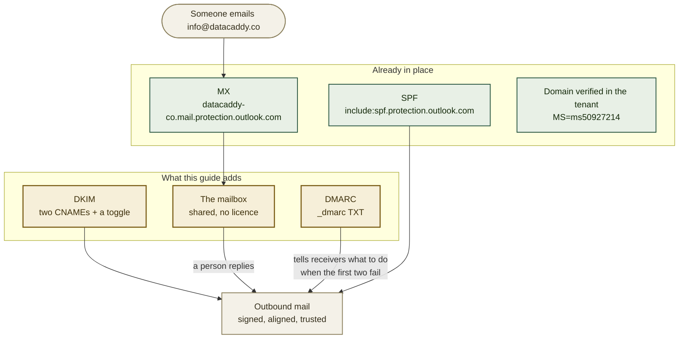

# Finishing `info@datacaddy.co`: DKIM, DMARC, and the mailbox

> **Not done — this is the work outstanding.** `datacaddy.co` is already a verified domain in the **ASO DB Solutions** Microsoft 365 tenant and mail already routes there: MX, SPF and autodiscover are all in place. Three things are missing — DKIM, DMARC, and the mailbox itself. Read the present tense below as "what to do". Update this banner when all three are done.

The site now shows `info@datacaddy.co` and the contact form notifies it, so the address has to
work and its mail has to be trusted. If you are here because replies from the address land in
spam, the cause is almost certainly DKIM — step 1 is what fixes it.

Most of the hard part is already done, and by someone else: the domain was added to the tenant
and mail routing was configured when the DNS records went in. What follows completes it.

## Where this fits



**Order matters.** DKIM before DMARC: a DMARC policy that enforces before signing works will
quarantine your own legitimate mail.

## Already-known values

| Value | What it is |
|---|---|
| `datacaddy.co` | Verified, cloud-managed domain in the tenant |
| `dddcec62-0394-4988-a63c-c8156b2d7670` | The tenant ID, shared with `asodb.com.br` |
| `asodb1.onmicrosoft.com` | The tenant's initial domain — what the DKIM records point at |
| `selector1-datacaddy-co._domainkey.asodb1.onmicrosoft.com` | DKIM target, selector 1 |
| `selector2-datacaddy-co._domainkey.asodb1.onmicrosoft.com` | DKIM target, selector 2 |
| `v=DMARC1;p=quarantine;pct=100;rua=mailto:mar.ats@asodb.com.br;ruf=mailto:mar.ats@asodb.com.br;ri=86400;fo=1;` | The policy **`asodb.com.br` already publishes** — the house standard to match |
| `datacaddy-co.mail.protection.outlook.com` | Existing MX, do not change |

The DKIM targets were derived, not guessed: `asodb.com.br` sits in the same tenant and already
publishes `selector1-asodb-com-br._domainkey.asodb1.onmicrosoft.com`. Microsoft builds the name
from the domain with dots replaced by hyphens, so `datacaddy.co` becomes `datacaddy-co`. The
portal will show you the same values in step 1 — confirm they match before publishing.

## Set these first

```bash
# already known -- see table above, included here for copy-paste convenience
export SITE_DOMAIN="datacaddy.co"
export TENANT_INITIAL="asodb1.onmicrosoft.com"
export CONTACT="info@datacaddy.co"
```

## Read this before you start: what this can't do

- **It cannot be done from the repository.** Every step is in a Microsoft portal or in Cloudflare
  DNS. Nothing here changes with a deploy.
- **It will not break the contact form.** Netlify sends its notification from Netlify's own
  servers, not as `datacaddy.co`, so DMARC does not apply to it. What DMARC protects is mail a
  person sends *from* the address.
- **It cannot confirm whether the mailbox already exists.** DNS and the public login endpoints
  answer the same way for an address that exists and one that does not. That is a check in the
  admin centre, and it is step 2.
- **DNS is not instant.** Cloudflare publishes quickly, but Microsoft's DKIM validation can take
  a few minutes to several hours to see the records. A failure immediately after publishing is
  usually impatience, not misconfiguration.

## 1. Turn on DKIM — ADMIN

Without DKIM, outbound mail carries no cryptographic signature, and receivers fall back to SPF
alone. That is weaker, and it breaks entirely when a message is forwarded.

Go to **[security.microsoft.com](https://security.microsoft.com)** →
**Email & collaboration** → **Policies & rules** → **Threat policies** →
**Email authentication settings** → **DKIM**.

Select **datacaddy.co**. It will show as not signing, and offer the two CNAME records it expects.
**Compare them against the table above** — they should match exactly. If they do not, the portal
is authoritative; use its values and tell us, because it means the tenant's initial domain is not
what this guide assumes.

Publish both records in Cloudflare, **with the proxy off** (grey cloud — a CNAME under proxy
returns Cloudflare's address, not Microsoft's, and validation fails):

| Type | Name | Value | Proxy |
|---|---|---|---|
| CNAME | `selector1._domainkey` | `selector1-datacaddy-co._domainkey.asodb1.onmicrosoft.com` | **OFF** |
| CNAME | `selector2._domainkey` | `selector2-datacaddy-co._domainkey.asodb1.onmicrosoft.com` | **OFF** |

Return to the DKIM page and switch **Sign messages for this domain with DKIM signatures** to
**Enabled**. If it refuses, the records have not propagated yet — wait and retry rather than
changing anything.

## 2. Create the mailbox — ADMIN

**Use a shared mailbox.** A shared mailbox needs **no licence**, holds up to 50 GB, can be opened
by several people at once, and can send *as* `info@datacaddy.co` — which is what a shared
company address needs. A licensed user mailbox would cost a seat per month for the same result.

**[admin.microsoft.com](https://admin.microsoft.com)** → **Teams & groups** →
**Shared mailboxes** → **Add a shared mailbox**.

- Name: `DataCaddy`
- Email: `info@datacaddy.co`
- Then **Members** → add whoever should read and reply.

An **alias** on an existing mailbox is the cheaper-looking alternative and is worth rejecting
deliberately: replies then come *from* the person's own address unless they remember to change
the sender each time, which turns a company address into a personal one at exactly the moment a
prospect is reading.

## 3. Publish DMARC — ADMIN

DMARC tells receiving servers what to do when SPF and DKIM fail, and gives you reports about who
is sending mail claiming to be you. Without it the domain is straightforwardly spoofable.

**Start at `p=none` for about two weeks**, then move to the house policy. `none` enforces nothing
and only collects reports — which is the point: it proves signing works before anything starts
being quarantined.

| Type | Name | Value | Proxy |
|---|---|---|---|
| TXT | `_dmarc` | `v=DMARC1; p=none; rua=mailto:mar.ats@asodb.com.br; ri=86400; fo=1;` | n/a |

After two clean weeks of reports, replace it with the policy `asodb.com.br` already uses, so both
company domains behave the same way:

```
v=DMARC1;p=quarantine;pct=100;rua=mailto:mar.ats@asodb.com.br;ruf=mailto:mar.ats@asodb.com.br;ri=86400;fo=1;
```

One note on that policy rather than a change to it: `ruf` requests **forensic reports**, which can
contain message content and which most large providers no longer send. It is harmless, and it is
matched here for consistency with the existing domain rather than because it does much.

## Verify

```bash
# 1. DKIM records published and pointing at the right tenant
getent hosts selector1._domainkey.datacaddy.co   # resolution alone is enough
python3 - <<'PY'
import json, urllib.request
for n in ("selector1._domainkey.datacaddy.co", "selector2._domainkey.datacaddy.co"):
    r = json.load(urllib.request.urlopen(f"https://dns.google/resolve?name={n}&type=CNAME"))
    print(n, "->", [a["data"] for a in r.get("Answer", [])] or "NOT SET")
PY

# 2. DMARC published
python3 -c "import json,urllib.request;r=json.load(urllib.request.urlopen('https://dns.google/resolve?name=_dmarc.datacaddy.co&type=TXT'));print([a['data'] for a in r.get('Answer',[])] or 'NOT SET')"

# 3. The real test: send a message FROM info@datacaddy.co to a Gmail address,
#    open it, and use "Show original". All three must read PASS:
#      SPF: PASS   DKIM: PASS   DMARC: PASS
```

Step 3 is the one that matters. The first two only prove the records exist; only a delivered
message proves the chain works end to end.

## Troubleshooting

**The DKIM toggle will not enable.** The CNAMEs have not propagated, or the Cloudflare proxy is
on. Confirm both records resolve to `…asodb1.onmicrosoft.com` and that neither shows an orange
cloud, then retry. Microsoft caches negative lookups, so allow time between attempts.

**Mail from the address lands in spam.** Check `DKIM: PASS` in a received message's original. If
it says `none`, signing is not actually on, regardless of what the DNS says.

**Legitimate mail started being quarantined after step 3.** DMARC was enforced before DKIM was
verified working. Set `p=none`, confirm `DKIM: PASS` on a real message, then re-enforce.

**Someone replies and it comes from their own address, not `info@`.** The shared mailbox exists
but they are replying from their own inbox. They need to open the shared mailbox and send from
it, or use the *Send as* option.

**The contact form's notification stopped arriving.** Unrelated to any of this — Netlify sends
that mail, not Microsoft. See [`NETLIFY-FORMS-SETUP.md`](NETLIFY-FORMS-SETUP.md).

## Relationship to the other guides

- [`NETLIFY-FORMS-SETUP.md`](NETLIFY-FORMS-SETUP.md) covers the other half of the contact path:
  where a form submission goes before it reaches this mailbox.
- [`NETLIFY-SETUP.md`](NETLIFY-SETUP.md) covers the site's own DNS. The records here are
  additional to those and do not conflict — mail and web records coexist in the same zone.
- [`PUBLIC-SURFACE.md`](PUBLIC-SURFACE.md) notes that publishing mail records announces which
  provider the company uses. That is normal and unavoidable.

---

**pt-BR edition:** [`MICROSOFT-EMAIL-SETUP.pt-BR.md`](MICROSOFT-EMAIL-SETUP.pt-BR.md). Both stay
in step on sections and literal values.
