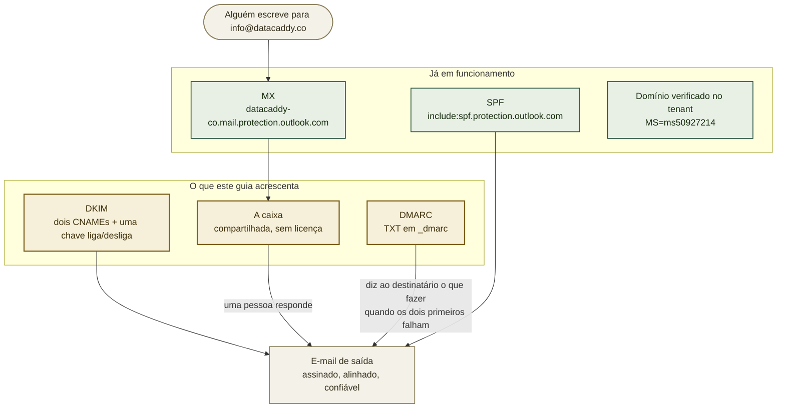

# Concluindo o `info@datacaddy.co`: DKIM, DMARC e a caixa

> **Pendente — este é o trabalho a ser feito.** `datacaddy.co` já é um domínio verificado no tenant Microsoft 365 da **ASO DB Solutions** e o e-mail já é roteado para lá: MX, SPF e autodiscover estão todos no lugar. Faltam três coisas — DKIM, DMARC e a caixa em si. Leia os verbos no presente abaixo como "o que fazer". Atualize este aviso quando as três estiverem prontas.

O site já exibe `info@datacaddy.co` e o formulário de contato notifica esse endereço, então ele
precisa funcionar e o e-mail dele precisa ser confiável. Se você chegou aqui porque as respostas
enviadas desse endereço caem em spam, a causa é quase certamente o DKIM — o passo 1 é o que
resolve.

A parte mais trabalhosa já está feita, e por outra pessoa: o domínio foi adicionado ao tenant e o
roteamento de e-mail foi configurado quando os registros de DNS entraram. O que segue conclui.

## Onde isso se encaixa



**A ordem importa.** DKIM antes de DMARC: uma política DMARC que já exija conformidade antes de a
assinatura funcionar vai colocar em quarentena o e-mail legítimo da própria empresa.

## Valores já conhecidos

| Valor | O que é |
|---|---|
| `datacaddy.co` | Domínio verificado e gerenciado na nuvem, dentro do tenant |
| `dddcec62-0394-4988-a63c-c8156b2d7670` | O ID do tenant, o mesmo de `asodb.com.br` |
| `asodb1.onmicrosoft.com` | Domínio inicial do tenant — para onde os registros DKIM apontam |
| `selector1-datacaddy-co._domainkey.asodb1.onmicrosoft.com` | Destino do DKIM, seletor 1 |
| `selector2-datacaddy-co._domainkey.asodb1.onmicrosoft.com` | Destino do DKIM, seletor 2 |
| `v=DMARC1;p=quarantine;pct=100;rua=mailto:mar.ats@asodb.com.br;ruf=mailto:mar.ats@asodb.com.br;ri=86400;fo=1;` | A política que **`asodb.com.br` já publica** — o padrão da casa a ser seguido |
| `datacaddy-co.mail.protection.outlook.com` | MX existente, não alterar |

Os destinos do DKIM foram derivados, não adivinhados: `asodb.com.br` está no mesmo tenant e já
publica `selector1-asodb-com-br._domainkey.asodb1.onmicrosoft.com`. A Microsoft monta o nome a
partir do domínio trocando pontos por hífens, então `datacaddy.co` vira `datacaddy-co`. O portal
vai mostrar os mesmos valores no passo 1 — confirme que batem antes de publicar.

## Defina isto primeiro

```bash
# já conhecidos -- ver tabela acima, incluídos aqui para copiar e colar
export SITE_DOMAIN="datacaddy.co"
export TENANT_INITIAL="asodb1.onmicrosoft.com"
export CONTACT="info@datacaddy.co"
```

## Leia antes de começar: o que este guia não faz

- **Não é feito pelo repositório.** Todos os passos acontecem num portal da Microsoft ou no DNS da
  Cloudflare. Nada aqui muda com um deploy.
- **Não vai quebrar o formulário de contato.** A Netlify envia a notificação pelos servidores dela,
  não como `datacaddy.co`, então o DMARC não se aplica a esse envio. O que o DMARC protege é o
  e-mail que uma pessoa envia *a partir* do endereço.
- **Não consegue confirmar se a caixa já existe.** O DNS e os endpoints públicos de login respondem
  igual para um endereço que existe e para um que não existe. Essa verificação é no centro de
  administração, e é o passo 2.
- **DNS não é instantâneo.** A Cloudflare publica rápido, mas a validação do DKIM pela Microsoft
  pode levar de alguns minutos a algumas horas para enxergar os registros. Uma falha logo após
  publicar costuma ser pressa, não erro de configuração.

## 1. Ligar o DKIM — ADMIN

Sem DKIM, o e-mail de saída não leva assinatura criptográfica, e o destinatário fica só com o SPF.
Isso é mais fraco, e deixa de funcionar por completo quando uma mensagem é encaminhada.

Acesse **[security.microsoft.com](https://security.microsoft.com)** →
**Email & collaboration** → **Policies & rules** → **Threat policies** →
**Email authentication settings** → **DKIM**.

Selecione **datacaddy.co**. Ele aparecerá como não assinando, e oferecerá os dois registros CNAME
que espera. **Compare com a tabela acima** — devem bater exatamente. Se não baterem, o portal é a
fonte da verdade; use os valores dele e nos avise, porque significa que o domínio inicial do tenant
não é o que este guia assume.

Publique os dois registros na Cloudflare, **com o proxy desligado** (nuvem cinza — um CNAME sob
proxy devolve o endereço da Cloudflare, não o da Microsoft, e a validação falha):

| Tipo | Nome | Valor | Proxy |
|---|---|---|---|
| CNAME | `selector1._domainkey` | `selector1-datacaddy-co._domainkey.asodb1.onmicrosoft.com` | **DESLIGADO** |
| CNAME | `selector2._domainkey` | `selector2-datacaddy-co._domainkey.asodb1.onmicrosoft.com` | **DESLIGADO** |

Volte à página de DKIM e mude **Sign messages for this domain with DKIM signatures** para
**Enabled**. Se recusar, os registros ainda não propagaram — espere e tente de novo, em vez de
mudar alguma coisa.

## 2. Criar a caixa — ADMIN

**Use uma caixa compartilhada.** Uma caixa compartilhada **não consome licença**, comporta até
50 GB, pode ser aberta por várias pessoas ao mesmo tempo e pode enviar *como*
`info@datacaddy.co` — que é exatamente o que um endereço corporativo precisa. Uma caixa de usuário
licenciada custaria uma assinatura por mês para o mesmo resultado.

**[admin.microsoft.com](https://admin.microsoft.com)** → **Teams & groups** →
**Shared mailboxes** → **Add a shared mailbox**.

- Nome: `DataCaddy`
- E-mail: `info@datacaddy.co`
- Depois **Members** → adicione quem deve ler e responder.

Um **alias** numa caixa existente é a alternativa que parece mais barata, e vale recusar de forma
deliberada: as respostas passam a sair *do* endereço pessoal da pessoa, a menos que ela lembre de
trocar o remetente toda vez — o que transforma um endereço da empresa num endereço pessoal
exatamente no momento em que um possível cliente está lendo.

## 3. Publicar o DMARC — ADMIN

O DMARC diz aos servidores de destino o que fazer quando SPF e DKIM falham, e gera relatórios sobre
quem anda enviando e-mail se passando por você. Sem ele, o domínio é facilmente falsificável.

**Comece com `p=none` por cerca de duas semanas**, e depois mude para a política da casa. `none`
não impõe nada e só coleta relatórios — e é esse o objetivo: comprovar que a assinatura funciona
antes que qualquer coisa comece a ser colocada em quarentena.

| Tipo | Nome | Valor | Proxy |
|---|---|---|---|
| TXT | `_dmarc` | `v=DMARC1; p=none; rua=mailto:mar.ats@asodb.com.br; ri=86400; fo=1;` | n/a |

Depois de duas semanas de relatórios limpos, substitua pela política que `asodb.com.br` já usa,
para que os dois domínios da empresa se comportem igual:

```
v=DMARC1;p=quarantine;pct=100;rua=mailto:mar.ats@asodb.com.br;ruf=mailto:mar.ats@asodb.com.br;ri=86400;fo=1;
```

Uma observação sobre essa política, e não uma mudança nela: o `ruf` pede **relatórios forenses**,
que podem conter conteúdo de mensagem e que a maioria dos grandes provedores já não envia. É
inofensivo, e foi mantido aqui por consistência com o domínio existente, não porque faça muito.

## Verificação

```bash
# 1. Registros DKIM publicados e apontando para o tenant certo
getent hosts selector1._domainkey.datacaddy.co   # só resolver já basta
python3 - <<'PY'
import json, urllib.request
for n in ("selector1._domainkey.datacaddy.co", "selector2._domainkey.datacaddy.co"):
    r = json.load(urllib.request.urlopen(f"https://dns.google/resolve?name={n}&type=CNAME"))
    print(n, "->", [a["data"] for a in r.get("Answer", [])] or "NAO DEFINIDO")
PY

# 2. DMARC publicado
python3 -c "import json,urllib.request;r=json.load(urllib.request.urlopen('https://dns.google/resolve?name=_dmarc.datacaddy.co&type=TXT'));print([a['data'] for a in r.get('Answer',[])] or 'NAO DEFINIDO')"

# 3. O teste de verdade: envie uma mensagem DE info@datacaddy.co para um endereço
#    Gmail, abra e use "Mostrar original". Os três precisam dizer PASS:
#      SPF: PASS   DKIM: PASS   DMARC: PASS
```

O passo 3 é o que importa. Os dois primeiros só provam que os registros existem; apenas uma
mensagem entregue prova que a cadeia funciona de ponta a ponta.

## Solução de problemas

**A chave do DKIM não liga.** Os CNAMEs ainda não propagaram, ou o proxy da Cloudflare está ligado.
Confirme que os dois registros resolvem para `…asodb1.onmicrosoft.com` e que nenhum está com a
nuvem laranja, e tente de novo. A Microsoft guarda em cache as consultas que falharam, então dê um
intervalo entre as tentativas.

**O e-mail do endereço cai em spam.** Verifique `DKIM: PASS` no original de uma mensagem recebida.
Se disser `none`, a assinatura não está realmente ativa, independentemente do que o DNS mostre.

**E-mail legítimo começou a ir para quarentena depois do passo 3.** O DMARC foi imposto antes de o
DKIM estar comprovadamente funcionando. Volte para `p=none`, confirme `DKIM: PASS` numa mensagem
real, e só então volte a impor.

**Alguém responde e a mensagem sai do endereço pessoal, não do `info@`.** A caixa compartilhada
existe, mas a pessoa está respondendo pela caixa dela. Ela precisa abrir a caixa compartilhada e
enviar por ela, ou usar a opção *Enviar como*.

**A notificação do formulário de contato parou de chegar.** Não tem relação com nada disso — quem
envia esse e-mail é a Netlify, não a Microsoft. Ver
[`NETLIFY-FORMS-SETUP.pt-BR.md`](NETLIFY-FORMS-SETUP.pt-BR.md).

## Relação com os outros guias

- O [`NETLIFY-FORMS-SETUP.pt-BR.md`](NETLIFY-FORMS-SETUP.pt-BR.md) cobre a outra metade do caminho
  de contato: por onde passa um envio do formulário antes de chegar a esta caixa.
- O [`NETLIFY-SETUP.pt-BR.md`](NETLIFY-SETUP.pt-BR.md) cobre o DNS do próprio site. Os registros
  daqui são adicionais àqueles e não conflitam — registros de e-mail e de web convivem na mesma
  zona.
- O [`PUBLIC-SURFACE.pt-BR.md`](PUBLIC-SURFACE.pt-BR.md) observa que publicar registros de e-mail
  anuncia qual provedor a empresa usa. Isso é normal e inevitável.

---

**Edição em inglês:** [`MICROSOFT-EMAIL-SETUP.md`](MICROSOFT-EMAIL-SETUP.md). As duas se mantêm em
sincronia em seções e valores literais.
