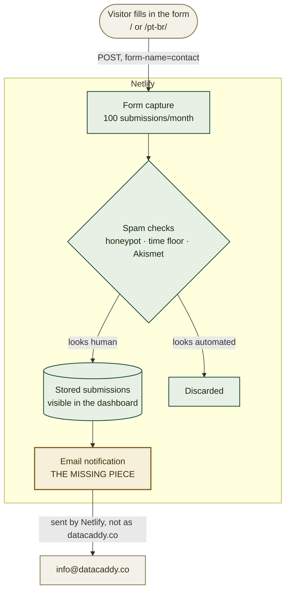

# Turning on the contact form's notifications

> **Partly done — the form is built, deployed and detected.** `datacaddy.co` has been serving the assessment form since 2026-09-11, and Netlify is capturing submissions. What is missing is the notification: right now a submission is stored and nobody is told. One setting closes that. Update this banner once a test submission has arrived by email.

Someone can fill in the form today and Netlify will keep what they wrote — but no one will know
until they log in and look. If you are here because a submission did not arrive by email, the
cause is almost certainly that no notification has been configured yet; step 1 is the whole fix.

This is the shorter half of the contact path. The other half — making `info@datacaddy.co` exist
and its mail trusted — is [`MICROSOFT-EMAIL-SETUP.md`](MICROSOFT-EMAIL-SETUP.md). **They are
independent**: notifications can be switched on and tested before the mailbox exists, by sending
them somewhere else in the meantime.

## Where this fits



Note where the notification comes from: **Netlify's own servers**, not from `datacaddy.co`. That
is why nothing in the Microsoft guide can break it, and why it works before the mailbox exists.

## Already-known values

| Value | What it is |
|---|---|
| `contact` | The form's name. Netlify matches submissions to it, so it must not be renamed casually |
| `name`, `email`, `company`, `message` | The fields, in that order |
| `bot-field` | The honeypot. Never remove it — it looks like dead markup and is not |
| `info@datacaddy.co` | Where notifications should go |
| **100 / month** | The free plan's submission limit |
| `/` | Where the form posts. Both locales post to the same place |

## Set these first

Nothing to export — every step is in the Netlify dashboard.

## Read this before you start: what this can't do

- **It cannot create the mailbox.** Netlify only sends *to* an address. Until
  `info@datacaddy.co` exists, point notifications at a mailbox that does — a personal company
  address is fine temporarily, and changing it later is one field.
- **It cannot recover submissions made before notifications existed.** They are not lost: they are
  in the dashboard under **Forms**. Check there once, now, in case someone has already written in.
- **It cannot raise the 100/month limit.** That is the free plan. At this site's traffic it is not
  a near-term concern, but it is a hard stop rather than a soft one, so it is worth knowing.
- **It cannot stop all spam.** The form has a honeypot and a submit-time floor, and Netlify adds
  its own filtering. A public form on a public repository will still attract some.

## 1. Set the notification address — OWNER

**[app.netlify.com](https://app.netlify.com)** → your site → **Forms**.

You should see a form named **contact** with a submission count. If it is not there at all, see
Troubleshooting — it means the deploy that introduced the form has not been picked up.

Then: **Form notifications** → **Add notification** → **Email notification**.

- **Event to listen for**: New form submission
- **Form**: `contact`
- **Email to notify**: `info@datacaddy.co` — or a working address in the meantime

Save. That is the whole change.

## 2. Send a test submission — OWNER

Go to [datacaddy.co](https://datacaddy.co), fill the form in properly, and submit.

**Take more than three seconds over it.** The form silently discards submissions completed faster
than a person plausibly could — a deliberate anti-bot measure — and it shows the same success
message either way, so a rushed test looks like it worked while going nowhere.

Then check both places: the submission should appear under **Forms**, and the notification should
arrive by email within a minute or two.

## 3. Decide who gets told — OWNER

A single address is the simplest arrangement and the one to start with. Two refinements are worth
knowing about, neither urgent:

- **More than one recipient**: add a second email notification rather than trying to comma-separate
  addresses in one.
- **A shared mailbox as the target** means everyone with access sees new submissions without any
  forwarding rules — which is the argument for making `info@` shared rather than an alias, in the
  Microsoft guide.

## Verify

```bash
# 1. The form is present in what Netlify actually deployed.
#    This is what its parser reads; if it is absent, nothing else matters.
curl -sS https://datacaddy.co/ | grep -o 'name="contact"' | head -1

# 2. The field names in the deployed HTML match what the page submits.
curl -sS https://datacaddy.co/ \
  | tr '>' '>\n' | grep -oE 'name="(name|email|company|message|bot-field|form-name)"' | sort -u
```

Expected: `name="contact"` present, and all six field names listed. Then the real check, which no
command can do: a test submission appearing in **Forms** *and* arriving by email.

## Troubleshooting

**No `contact` form appears in the dashboard.** Netlify's parser runs at build time against static
HTML and cannot see a React-rendered form. The repository carries a hidden static mirror in
`index.html` for exactly this reason. If it is missing, a deploy removed it — check the verify
step above against the live site, and redeploy.

**Submissions return a 404.** The field names in the hidden form and the React component have
drifted apart. They must match exactly. CI checks this, so a 404 means something changed outside
the normal path.

**Notifications do not arrive, but submissions appear in the dashboard.** The notification is not
configured, is pointing at a different form, or the target mailbox does not exist yet. Check the
address first — an address that does not exist fails silently from Netlify's side.

**Submissions arrive marked as spam.** Netlify's filtering is aggressive by default. Spam
submissions are still visible under **Forms → Spam** — check there before concluding a message was
lost.

**A test submission showed success but never appeared.** Almost certainly the submit-time floor:
the form was completed in under three seconds. Fill it in at a normal pace and retry.

**Volume is approaching 100 in a month.** Consider whether the traffic is genuine before upgrading.
If it is, the free plan's limit is the reason to move the endpoint — the form posts to a single
configurable endpoint precisely so that is a setting change rather than a rewrite.

## Relationship to the other guides

- [`MICROSOFT-EMAIL-SETUP.md`](MICROSOFT-EMAIL-SETUP.md) is the other half: making
  `info@datacaddy.co` exist and be trusted. Independent of this guide, and doable in either order.
- ADR-0003 records *why* Netlify Forms, and the consequences accepted with it — including that
  submissions are stored on Netlify, which makes them a data processor.
- [`PUBLIC-SURFACE.md`](PUBLIC-SURFACE.md) covers what the form exposes, and why the endpoint being
  visible in the page's code is safe while an API key would not be.

---

**pt-BR edition:** [`NETLIFY-FORMS-SETUP.pt-BR.md`](NETLIFY-FORMS-SETUP.pt-BR.md). Both stay in
step on sections and literal values.
