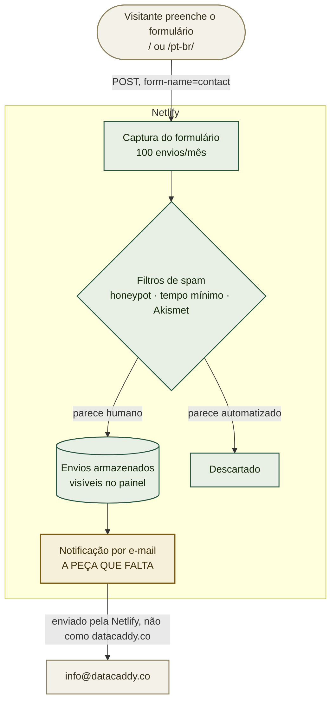

# Ligando as notificações do formulário de contato

> **Ainda não funciona — e a versão anterior deste documento errou o motivo.** Ela dizia que o formulário estava "pronto, publicado e detectado" e que só faltava a notificação. Ele não estava detectado. **A detecção de formulários da Netlify vem desligada por padrão em sites criados desde 2023-04-12**, então todo envio desde o lançamento respondeu 404 e foi descartado — não há nada esperando no painel. Ligar a detecção é o passo 1 e exige um novo deploy; a notificação é o passo 2. Atualize este aviso assim que um envio de teste chegar por e-mail.

Alguém pode preencher o formulário hoje e a Netlify guarda o que foi escrito — mas ninguém vai
saber até entrar e olhar. Se você chegou aqui porque um envio não chegou por e-mail, a causa é
quase certamente que nenhuma notificação foi configurada ainda; o passo 1 é a correção inteira.

Esta é a metade mais curta do caminho de contato. A outra metade — fazer o `info@datacaddy.co`
existir e ter e-mail confiável — é o
[`MICROSOFT-EMAIL-SETUP.pt-BR.md`](MICROSOFT-EMAIL-SETUP.pt-BR.md). **Elas são independentes**: as
notificações podem ser ligadas e testadas antes de a caixa existir, enviando para outro endereço
nesse meio-tempo.

## Onde isso se encaixa



Repare de onde sai a notificação: dos **servidores da própria Netlify**, não de `datacaddy.co`. É
por isso que nada no guia da Microsoft pode quebrá-la, e por isso ela funciona antes de a caixa
existir.

## Valores já conhecidos

| Valor | O que é |
|---|---|
| `contact` | O nome do formulário. A Netlify casa os envios por ele, então não pode ser renomeado sem cuidado |
| `name`, `email`, `company`, `message` | Os campos, nessa ordem |
| `bot-field` | O honeypot. Nunca remova — parece código morto e não é |
| `info@datacaddy.co` | Para onde as notificações devem ir |
| **100 / mês** | O limite de envios do plano gratuito |
| `/` | Para onde o formulário envia. Os dois idiomas enviam para o mesmo lugar |

## Defina isto primeiro

Nada a exportar — todos os passos são no painel da Netlify.

## Leia antes de começar: o que este guia não faz

- **Não cria a caixa postal.** A Netlify apenas envia *para* um endereço. Enquanto o
  `info@datacaddy.co` não existir, aponte as notificações para uma caixa que exista — um endereço
  corporativo pessoal serve por ora, e trocar depois é um campo só.
- **Não recupera envios feitos antes de haver notificação.** Eles não estão perdidos: estão no
  painel, em **Forms**. Confira lá uma vez, agora, caso alguém já tenha escrito.
- **Não aumenta o limite de 100/mês.** Esse é o plano gratuito. Para o tráfego atual do site não é
  uma preocupação de curto prazo, mas é um limite rígido, não flexível — vale saber.
- **Não elimina todo o spam.** O formulário tem honeypot e tempo mínimo de preenchimento, e a
  Netlify acrescenta a filtragem dela. Um formulário público num repositório público ainda assim
  atrai alguma coisa.

## 1. Ligar a detecção de formulários, e republicar — OWNER

**Este é o passo que faltava, e nada funciona sem ele.** A Netlify deixa a detecção de formulários
desligada por padrão em todo site criado desde 2023-04-12, para acelerar os builds. Com ela
desligada, o analisador nunca procura formulários no build, o `contact` nunca é registrado, e todo
POST para ele responde `404` — indistinguível de um formulário que não existe.

**Forms → Usage and configuration → Form detection → Enable form detection.**

Depois **republique**: Deploys → Trigger deploy → Deploy site. Ligar a detecção vale apenas para
deploys *novos*, nunca retroativamente, então o build atual continua sem ser analisado até que um
rode.

Verifique antes de seguir — isto precisa responder `200`, não `404`:

```bash
curl -sS -o /dev/null -w '%{http_code}\n' -X POST \
  -H 'Content-Type: application/x-www-form-urlencoded' \
  --data 'form-name=contact&name=Teste&email=teste@example.com&message=checagem' \
  https://datacaddy.co/
```

## 2. Definir o endereço de notificação — OWNER

**[app.netlify.com](https://app.netlify.com)** → seu site → **Forms**.

Você deve ver um formulário chamado **contact** com uma contagem de envios. Se ele não aparecer,
veja a Solução de problemas — significa que o deploy que introduziu o formulário não foi
detectado.

Depois: **Form notifications** → **Add notification** → **Email notification**.

- **Event to listen for**: New form submission
- **Form**: `contact`
- **Email to notify**: `info@datacaddy.co` — ou um endereço que funcione, nesse meio-tempo

Salve. A mudança é só essa.

## 3. Enviar um teste — OWNER

Acesse o [datacaddy.co](https://datacaddy.co), preencha o formulário direito e envie.

**Leve mais de três segundos nisso.** O formulário descarta silenciosamente envios concluídos mais
rápido do que uma pessoa plausivelmente conseguiria — uma medida deliberada contra robôs — e exibe
a mesma mensagem de sucesso nos dois casos, então um teste apressado parece ter funcionado sem ter
ido a lugar nenhum.

Depois confira os dois lugares: o envio deve aparecer em **Forms**, e a notificação deve chegar por
e-mail em um ou dois minutos.

## 4. Decidir quem é avisado — OWNER

Um único endereço é o arranjo mais simples e o certo para começar. Dois refinamentos valem ser
conhecidos, nenhum urgente:

- **Mais de um destinatário**: acrescente uma segunda notificação por e-mail, em vez de tentar
  separar endereços por vírgula em uma só.
- **Uma caixa compartilhada como destino** faz com que todos com acesso vejam os novos envios sem
  nenhuma regra de encaminhamento — que é justamente o argumento para o `info@` ser compartilhado
  em vez de alias, no guia da Microsoft.

## Verificação

```bash
# 1. O formulário está presente no que a Netlify realmente publicou.
#    É isso que o analisador dela lê; se estiver ausente, o resto não importa.
curl -sS https://datacaddy.co/ | grep -o 'name="contact"' | head -1

# 2. Os nomes dos campos no HTML publicado batem com o que a página envia.
curl -sS https://datacaddy.co/ \
  | tr '>' '>\n' | grep -oE 'name="(name|email|company|message|bot-field|form-name)"' | sort -u
```

Esperado: `name="contact"` presente, e os seis nomes de campo listados. Depois a verificação de
verdade, que nenhum comando faz: um envio de teste aparecendo em **Forms** *e* chegando por e-mail.

## Solução de problemas

**Nenhum formulário `contact` aparece no painel, e os envios respondem 404.** São duas causas
diferentes, e a primeira é bem mais provável:

1. **A detecção de formulários está desligada** — o padrão desde 2023-04-12. O passo 1 resolve, e
   exige um novo deploy depois. Foi essa a causa aqui, e é difícil de diagnosticar porque o sintoma
   é idêntico ao de um formulário que nunca foi escrito.
2. **O espelho estático oculto sumiu.** O analisador da Netlify roda no build sobre HTML estático e
   não enxerga um formulário renderizado pelo React, por isso o `index.html` carrega um espelho. Se
   um deploy o removeu, a verificação do passo 1 responde 404 mesmo com a detecção ligada.

**Os envios respondem 404.** Os nomes dos campos no formulário oculto e no componente React
divergiram. Precisam bater exatamente. O CI checa isso, então um 404 significa que algo mudou fora
do caminho normal.

**As notificações não chegam, mas os envios aparecem no painel.** A notificação não está
configurada, está apontando para outro formulário, ou a caixa de destino ainda não existe. Confira
o endereço primeiro — um endereço inexistente falha silenciosamente do lado da Netlify.

**Os envios chegam marcados como spam.** A filtragem da Netlify é agressiva por padrão. Envios
marcados como spam continuam visíveis em **Forms → Spam** — confira lá antes de concluir que uma
mensagem se perdeu.

**Um envio de teste mostrou sucesso mas nunca apareceu.** Quase certamente o tempo mínimo de
preenchimento: o formulário foi concluído em menos de três segundos. Preencha em ritmo normal e
tente de novo.

**O volume está chegando a 100 no mês.** Avalie se o tráfego é legítimo antes de fazer upgrade. Se
for, o limite do plano gratuito é o motivo para trocar o endpoint — o formulário envia para um
único endpoint configurável exatamente para que isso seja uma mudança de configuração e não uma
reescrita.

## Relação com os outros guias

- O [`MICROSOFT-EMAIL-SETUP.pt-BR.md`](MICROSOFT-EMAIL-SETUP.pt-BR.md) é a outra metade: fazer o
  `info@datacaddy.co` existir e ser confiável. Independente deste guia, e pode ser feito em
  qualquer ordem.
- O ADR-0003 registra *por que* Netlify Forms, e as consequências aceitas junto — inclusive que os
  envios ficam armazenados na Netlify, o que a torna uma operadora de dados.
- O [`PUBLIC-SURFACE.pt-BR.md`](PUBLIC-SURFACE.pt-BR.md) cobre o que o formulário expõe, e por que
  o endpoint estar visível no código da página é seguro enquanto uma chave de API não seria.

---

**Edição em inglês:** [`NETLIFY-FORMS-SETUP.md`](NETLIFY-FORMS-SETUP.md). As duas se mantêm em
sincronia em seções e valores literais.
