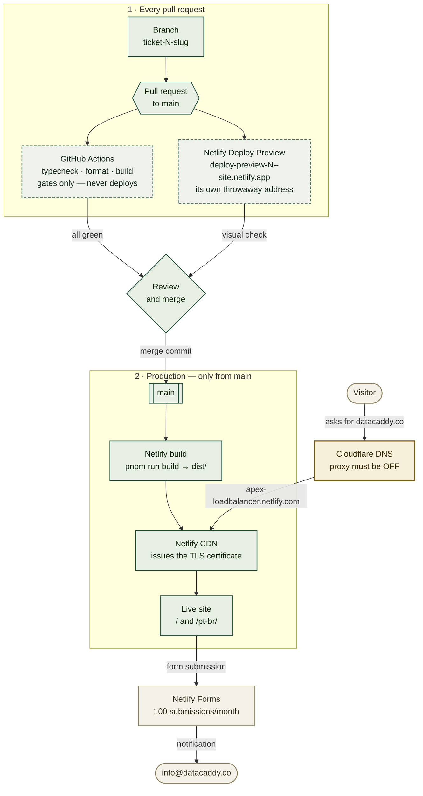

# Netlify hosting setup for `datacaddy.co`

> **Not done — this is the work outstanding.** The repository builds and is pushed; nothing is deployed yet and `datacaddy.co` has no address record. Read the present tense below as "what to do", not as a record of what happened. Update this banner when the site is live.

This stands the DataCaddy site up on **Netlify Free** and points `datacaddy.co` at it. It is for whoever holds the Netlify account and whoever manages DNS — two roles that may be two people. If you are here because the site deploys fine but the custom domain shows a certificate warning, skip to [Troubleshooting](#troubleshooting); the cause is almost always the Cloudflare proxy being left on.

The DNS half of this document is deliberately a **parameter table, not instructions**. DNS for `datacaddy.co` is administered by Marcelo, who does not need to be told how to add a record — he needs the exact values. They are in [DNS parameters](#dns-parameters-hand-these-over).

## Where this fits

Two paths reach Netlify, and only one of them reaches the public. A pull request gets
**checked twice and published to a throwaway address**; production is built **only from `main`**.



Dashed boxes are **checks that gate but never publish**. The amber box is the one setting that
silently breaks TLS if it is wrong — see [DNS parameters](#dns-parameters-hand-these-over).

## Already-known values

| Value | What it is |
|---|---|
| `ASO-DB-Solutions/site-datacaddy` | The repository. Public since 2026-09-10. |
| `main` | Branch Netlify deploys to production from. |
| `pnpm run build` | Build command — already in `netlify.toml`, do not retype it in the UI. |
| `dist` | Publish directory — likewise already in `netlify.toml`. |
| `22` | Node version, pinned by `.node-version` and `netlify.toml`. |
| `datacaddy.co` | Production domain. Registered at **Cloudflare**; DNS on `doug.ns.cloudflare.com` / `lana.ns.cloudflare.com`. |
| `info@datacaddy.co` | Contact address shown on the site and the Netlify Forms notification target. |
| `75.2.60.5` | Netlify's load-balancer IPv4, for apex A records. |
| `apex-loadbalancer.netlify.com` | Netlify's apex target for ALIAS / ANAME / flattened CNAME. Preferred over the raw IP. |

## Set these first

```bash
# already known -- see table above, included here for copy-paste convenience
export REPO="ASO-DB-Solutions/site-datacaddy"
export SITE_DOMAIN="datacaddy.co"
export CONTACT_EMAIL="info@datacaddy.co"
```

## Read this before you start: what this can't do

- **It cannot move DNS off Cloudflare.** `datacaddy.co` is registered with Cloudflare Registrar, and [Cloudflare requires registrar domains to stay on Cloudflare nameservers](https://developers.cloudflare.com/dns/nameservers/nameserver-options/). Hosting DNS in Azure would mean transferring the registration to another registrar first — a separate decision, not a step here. **Microsoft 365 mail does not require Azure DNS**; its records work fine in Cloudflare.
- **It cannot create the `info@datacaddy.co` mailbox.** Netlify Forms only *sends* notifications to an address; the mailbox itself has to exist in the 365 tenant, or be a forwarder. Tracked separately.
- **It cannot make the site public to search engines.** `public/robots.txt` currently disallows everything, deliberately. That flip is its own commit at launch.
- **The `www` CNAME target is not knowable in advance.** Netlify assigns a random subdomain (e.g. `brave-curie-12345.netlify.app`) when the site is created. Step 2 is where you read it off.

## 1. Create the Netlify account — OWNER

Go to **https://app.netlify.com/signup** and choose **Sign up with GitHub**.

Use an account tied to the company, not a personal one — this becomes the deploy owner. The **Free** plan is correct and sufficient: it permits commercial use, which is the reason Netlify was chosen over Vercel's Hobby plan (see ADR-0003 (not yet written)).

When GitHub asks which repositories to authorise, choose **Only select repositories** and pick `site-datacaddy`. Do not grant the whole organisation.

## 2. Import the repository — OWNER

**Add new site → Import an existing project → GitHub →** `ASO-DB-Solutions/site-datacaddy`.

Netlify reads `netlify.toml` from the repo, so build command, publish directory, and Node version are already filled in. **Leave them alone.** If the form shows anything other than `pnpm run build` and `dist`, the file was not detected — stop and check you picked the right repo.

Click **Deploy**. The first build takes about a minute.

Then note the assigned subdomain, shown at the top of the site overview as `something-something-12345.netlify.app`. **Write it down — step 4 needs it.**

```bash
export NETLIFY_SUBDOMAIN="<paste-it-here>.netlify.app"
```

## 3. Set the form notification address — OWNER

**Site configuration → Forms → Form notifications → Add notification → Email notification.**

Send to `info@datacaddy.co`. Nothing will arrive until the contact form ships, but configuring it now means the first real submission is not lost.

## 4. DNS parameters — hand these over

These are the records for `datacaddy.co`. Marcelo administers the zone; he needs the values, not the procedure.

| Type | Name | Value | Proxy | Notes |
|---|---|---|---|---|
| CNAME *(flattened)* | `@` (apex) | `apex-loadbalancer.netlify.com` | **OFF** | Preferred. Cloudflare flattens CNAMEs at the apex, so this works where other providers would need the A record below. |
| A *(alternative)* | `@` (apex) | `75.2.60.5` | **OFF** | Use only if the flattened CNAME is unavailable. A fixed IP is more brittle. |
| CNAME | `www` | `$NETLIFY_SUBDOMAIN` from step 2 | **OFF** | e.g. `brave-curie-12345.netlify.app` |

**The proxy column is the part that goes wrong.** Cloudflare's orange-cloud proxy must be **off** (grey cloud, "DNS only") for both records. Left on, Cloudflare terminates TLS itself and Netlify cannot complete the Let's Encrypt HTTP-01 challenge; the symptom is a certificate error that looks like a Netlify fault and is not.

Mail records for `info@datacaddy.co` are **not** listed here. The Microsoft 365 admin centre generates its own MX/TXT/CNAME set when the domain is added to the tenant; those go into the same Cloudflare zone and do not conflict with the two records above.

## 5. Add the custom domain in Netlify — OWNER

Once the records are in place: **Site configuration → Domain management → Add a domain →** `datacaddy.co`.

Netlify verifies DNS, then issues a Let's Encrypt certificate automatically. Allow up to a day for global propagation, though in practice it is usually minutes. Set `datacaddy.co` as the **primary domain** so `www` redirects to it.

## Verify

```bash
# 1. Apex resolves to Netlify (75.2.60.5, or a Netlify-owned address)
getent hosts datacaddy.co

# 2. TLS is valid and served by Netlify
curl -sSI https://datacaddy.co | head -1
curl -sS -o /dev/null -w '%{http_code} %{ssl_verify_result}\n' https://datacaddy.co

# 3. The security headers from netlify.toml are actually applied
curl -sSI https://datacaddy.co | grep -iE 'strict-transport|x-content-type|referrer-policy'

# 4. Both locales serve, with the right language
curl -sS https://datacaddy.co/        | grep -oE '<html lang="[^"]*"'
curl -sS https://datacaddy.co/pt-br/  | grep -oE '<html lang="[^"]*"'

# 5. Still not indexable -- expected until the launch commit
curl -sS https://datacaddy.co/robots.txt
```

Expected: `200`, `ssl_verify_result` of `0`, three header lines present, `lang="en"` then `lang="pt-BR"`, and a `robots.txt` reading `Disallow: /`.

## Troubleshooting

**"Your connection is not private" / certificate error on the custom domain.** The Cloudflare proxy is on. Set both records to DNS-only (grey cloud), wait for TTL, then **Domain management → HTTPS → Verify DNS configuration** and renew the certificate.

**Netlify says "Check DNS configuration" and won't issue a certificate.** The apex record is missing or still points elsewhere. Confirm with `getent hosts datacaddy.co` that it answers at all — a domain with *no* A record resolves without an address, which is the state `datacaddy.co` was in before this runbook.

**Build fails with `pnpm: not found` or a lockfile error.** `netlify.toml` sets `NODE_VERSION=22` and Netlify enables Corepack from `package.json#packageManager` (`pnpm@10.34.3`). If it was overridden in the UI, clear the override — the file is the source of truth.

**Build succeeds but the page is blank.** Check the publish directory really is `dist`. A wrong value serves an empty directory with a 200, which looks like an application bug.

**Form submissions never arrive.** Netlify's parser only sees forms present in the built HTML at deploy time. A React-rendered form is invisible to it; the repo carries a hidden static form in `index.html` for exactly this reason. If it was removed, submissions 404.

**`www` shows the Netlify subdomain instead of redirecting.** `datacaddy.co` is not set as primary. Domain management → set primary domain.

## Relationship to the other guides

- `ADR-0003` (not yet written) records *why* Netlify Free, and why not GitHub Pages, Vercel Hobby, or Azure Static Web Apps.
- `ADR-0002` (not yet written) explains the two-shell `/` and `/pt-br/` layout this deployment serves.
- `.github/workflows/ci.yml` only *gates* pull requests. It does not deploy — Netlify builds independently, so the organisation's allowed-actions policy never sits in the deploy path.
- The sibling project's [`CICD-PIPELINE-SETUP.md`](https://github.com/ASO-DB-Solutions/integration-bot/blob/master/docs/CICD-PIPELINE-SETUP.md) describes a very different arrangement — a self-hosted runner deploying to an OCI VM. Nothing here resembles it, and deliberately so: this site has no secrets and no backend.

---

**pt-BR edition:** [`NETLIFY-SETUP.pt-BR.md`](NETLIFY-SETUP.pt-BR.md). Both stay in step on sections and literal values.
