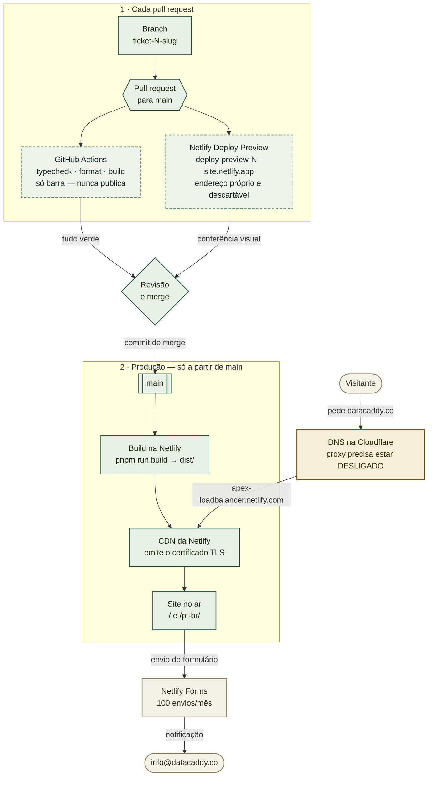

# Configuração da hospedagem Netlify para `datacaddy.co`

> **Pendente — este é o trabalho a ser feito.** O repositório compila e já foi enviado; nada está publicado ainda e `datacaddy.co` não tem registro de endereço. Leia o presente abaixo como "o que fazer", não como registro do que aconteceu. Atualize este aviso quando o site estiver no ar.

Este guia coloca o site do DataCaddy no ar na **Netlify Free** e aponta `datacaddy.co` para ele. Destina-se a quem detém a conta Netlify e a quem administra o DNS — dois papéis que podem ser duas pessoas. Se você chegou aqui porque o deploy funciona mas o domínio próprio exibe aviso de certificado, vá direto para [Solução de problemas](#solução-de-problemas); a causa é quase sempre o proxy da Cloudflare ter ficado ligado.

A parte de DNS deste documento é deliberadamente uma **tabela de parâmetros, não um passo a passo**. O DNS de `datacaddy.co` é administrado pelo Marcelo, que não precisa que lhe expliquem como criar um registro — precisa dos valores exatos. Eles estão em [Parâmetros de DNS](#parâmetros-de-dns--repasse-estes-valores).

## Onde isso se encaixa

Dois caminhos chegam à Netlify, e só um deles chega ao público. Um pull request é
**verificado duas vezes e publicado num endereço descartável**; a produção é construída
**somente a partir de `main`**.



As caixas tracejadas são **verificações que barram, mas nunca publicam**. A caixa âmbar é a
única configuração que quebra o TLS silenciosamente se estiver errada — ver
[Parâmetros de DNS](#parâmetros-de-dns--repasse-estes-valores).

## Valores já conhecidos

| Valor | O que é |
|---|---|
| `ASO-DB-Solutions/site-datacaddy` | O repositório. Público desde 2026-09-10. |
| `main` | Branch a partir do qual a Netlify publica em produção. |
| `pnpm run build` | Comando de build — já está no `netlify.toml`, não redigite na interface. |
| `dist` | Diretório publicado — idem, já está no `netlify.toml`. |
| `22` | Versão do Node, fixada por `.node-version` e `netlify.toml`. |
| `datacaddy.co` | Domínio de produção. Registrado na **Cloudflare**; DNS em `doug.ns.cloudflare.com` / `lana.ns.cloudflare.com`. |
| `info@datacaddy.co` | Endereço de contato exibido no site e destino das notificações do Netlify Forms. |
| `75.2.60.5` | IPv4 do balanceador da Netlify, para registro A no apex. |
| `apex-loadbalancer.netlify.com` | Destino da Netlify para ALIAS / ANAME / CNAME achatado no apex. Preferível ao IP puro. |

## Defina isto primeiro

```bash
# já conhecidos -- ver tabela acima, incluídos aqui para copiar e colar
export REPO="ASO-DB-Solutions/site-datacaddy"
export SITE_DOMAIN="datacaddy.co"
export CONTACT_EMAIL="info@datacaddy.co"
```

## Leia antes de começar: o que este guia não faz

- **Não move o DNS para fora da Cloudflare.** `datacaddy.co` está registrado no Cloudflare Registrar, e a [Cloudflare exige que domínios registrados nela permaneçam nos nameservers dela](https://developers.cloudflare.com/dns/nameservers/nameserver-options/). Hospedar o DNS no Azure exigiria antes transferir o registro para outro registrador — uma decisão à parte, não um passo daqui. **O Microsoft 365 não exige Azure DNS**; os registros dele funcionam normalmente na Cloudflare.
- **Não cria a caixa postal `info@datacaddy.co`.** O Netlify Forms apenas *envia* notificações para um endereço; a caixa precisa existir no tenant do 365, ou ser um encaminhamento. Tratado separadamente.
- **Não torna o site visível para buscadores.** O `public/robots.txt` atualmente bloqueia tudo, de propósito. Essa mudança é um commit próprio, no lançamento.
- **O destino do CNAME `www` não é conhecido de antemão.** A Netlify atribui um subdomínio aleatório (ex.: `brave-curie-12345.netlify.app`) quando o site é criado. O passo 2 é onde você o lê.

## 1. Criar a conta Netlify — OWNER

Acesse **https://app.netlify.com/signup** e escolha **Sign up with GitHub**.

Use uma conta ligada à empresa, não pessoal — ela passa a ser a dona do deploy. O plano **Free** é o correto e suficiente: ele permite uso comercial, que é a razão de a Netlify ter sido escolhida em vez do plano Hobby da Vercel (ver ADR-0003 (ainda não escrito)).

Quando o GitHub perguntar quais repositórios autorizar, escolha **Only select repositories** e marque `site-datacaddy`. Não conceda acesso à organização inteira.

## 2. Importar o repositório — OWNER

**Add new site → Import an existing project → GitHub →** `ASO-DB-Solutions/site-datacaddy`.

A Netlify lê o `netlify.toml` do repositório, então comando de build, diretório publicado e versão do Node já vêm preenchidos. **Não altere.** Se o formulário mostrar algo diferente de `pnpm run build` e `dist`, o arquivo não foi detectado — pare e confirme que escolheu o repositório certo.

Clique em **Deploy**. O primeiro build leva cerca de um minuto.

Depois anote o subdomínio atribuído, exibido no topo da visão geral do site como `algo-algo-12345.netlify.app`. **Anote — o passo 4 precisa dele.**

```bash
export NETLIFY_SUBDOMAIN="<cole-aqui>.netlify.app"
```

## 3. Definir o endereço de notificação do formulário — OWNER

**Site configuration → Forms → Form notifications → Add notification → Email notification.**

Enviar para `info@datacaddy.co`. Nada chegará enquanto o formulário de contato não existir, mas configurar agora garante que o primeiro envio real não se perca.

## 4. Parâmetros de DNS — repasse estes valores

Estes são os registros de `datacaddy.co`. O Marcelo administra a zona; ele precisa dos valores, não do procedimento.

| Tipo | Nome | Valor | Proxy | Observações |
|---|---|---|---|---|
| CNAME *(achatado)* | `@` (apex) | `apex-loadbalancer.netlify.com` | **DESLIGADO** | Preferível. A Cloudflare achata CNAME no apex, então funciona onde outros provedores exigiriam o registro A abaixo. |
| A *(alternativa)* | `@` (apex) | `75.2.60.5` | **DESLIGADO** | Use apenas se o CNAME achatado não estiver disponível. Um IP fixo é mais frágil. |
| CNAME | `www` | `$NETLIFY_SUBDOMAIN` do passo 2 | **DESLIGADO** | ex.: `brave-curie-12345.netlify.app` |

**A coluna do proxy é a parte que dá errado.** O proxy da Cloudflare (nuvem laranja) precisa estar **desligado** (nuvem cinza, "DNS only") nos dois registros. Ligado, a Cloudflare termina o TLS por conta própria e a Netlify não consegue concluir o desafio HTTP-01 do Let's Encrypt; o sintoma é um erro de certificado que parece falha da Netlify e não é.

Os registros de e-mail de `info@datacaddy.co` **não** estão listados aqui. O centro de administração do Microsoft 365 gera o próprio conjunto MX/TXT/CNAME quando o domínio é adicionado ao tenant; eles vão na mesma zona da Cloudflare e não conflitam com os dois registros acima.

## 5. Adicionar o domínio próprio na Netlify — OWNER

Com os registros já criados: **Site configuration → Domain management → Add a domain →** `datacaddy.co`.

A Netlify verifica o DNS e emite um certificado Let's Encrypt automaticamente. Considere até um dia para a propagação global, embora na prática costume levar minutos. Defina `datacaddy.co` como **domínio primário**, para que `www` redirecione para ele.

## Verificação

```bash
# 1. O apex resolve para a Netlify (75.2.60.5, ou um endereço da Netlify)
getent hosts datacaddy.co

# 2. O TLS é válido e servido pela Netlify
curl -sSI https://datacaddy.co | head -1
curl -sS -o /dev/null -w '%{http_code} %{ssl_verify_result}\n' https://datacaddy.co

# 3. Os cabeçalhos de segurança do netlify.toml estão mesmo aplicados
curl -sSI https://datacaddy.co | grep -iE 'strict-transport|x-content-type|referrer-policy'

# 4. Os dois idiomas respondem, com o idioma correto
curl -sS https://datacaddy.co/        | grep -oE '<html lang="[^"]*"'
curl -sS https://datacaddy.co/pt-br/  | grep -oE '<html lang="[^"]*"'

# 5. Ainda não indexável -- esperado até o commit de lançamento
curl -sS https://datacaddy.co/robots.txt
```

Esperado: `200`, `ssl_verify_result` igual a `0`, as três linhas de cabeçalho presentes, `lang="en"` e depois `lang="pt-BR"`, e um `robots.txt` com `Disallow: /`.

## Solução de problemas

**"Sua conexão não é particular" / erro de certificado no domínio próprio.** O proxy da Cloudflare está ligado. Coloque os dois registros em DNS only (nuvem cinza), aguarde o TTL, e então **Domain management → HTTPS → Verify DNS configuration** e renove o certificado.

**A Netlify diz "Check DNS configuration" e não emite o certificado.** O registro do apex está ausente ou ainda aponta para outro lugar. Confirme com `getent hosts datacaddy.co` que ele responde — um domínio *sem* registro A resolve sem endereço, que era exatamente o estado de `datacaddy.co` antes deste guia.

**O build falha com `pnpm: not found` ou erro de lockfile.** O `netlify.toml` define `NODE_VERSION=22` e a Netlify habilita o Corepack a partir de `package.json#packageManager` (`pnpm@10.34.3`). Se algo foi sobrescrito na interface, remova a sobrescrita — o arquivo é a fonte da verdade.

**O build passa mas a página fica em branco.** Verifique se o diretório publicado é mesmo `dist`. Um valor errado serve um diretório vazio com 200, o que parece bug da aplicação.

**Os envios do formulário nunca chegam.** O analisador da Netlify só enxerga formulários presentes no HTML compilado no momento do deploy. Um formulário renderizado pelo React é invisível para ele; o repositório carrega um formulário estático oculto em `index.html` exatamente por isso. Se ele for removido, os envios respondem 404.

**`www` mostra o subdomínio da Netlify em vez de redirecionar.** `datacaddy.co` não está definido como primário. Domain management → defina o domínio primário.

## Relação com os outros guias

- `ADR-0003` (ainda não escrito) registra *por que* Netlify Free, e por que não GitHub Pages, Vercel Hobby ou Azure Static Web Apps.
- `ADR-0002` (ainda não escrito) explica o arranjo de duas shells, `/` e `/pt-br/`, que este deploy serve.
- O `.github/workflows/ci.yml` apenas *barra* pull requests. Ele não publica — a Netlify compila por conta própria, então a política de actions permitidas da organização nunca entra no caminho do deploy.
- O [`CICD-PIPELINE-SETUP.md`](https://github.com/ASO-DB-Solutions/integration-bot/blob/master/docs/CICD-PIPELINE-SETUP.md) do projeto irmão descreve um arranjo bem diferente — um runner auto-hospedado publicando numa VM da OCI. Nada aqui se parece com aquilo, e deliberadamente: este site não tem segredos nem backend.

---

**Edição em inglês:** [`NETLIFY-SETUP.md`](NETLIFY-SETUP.md). As duas se mantêm em sincronia em seções e valores literais.
