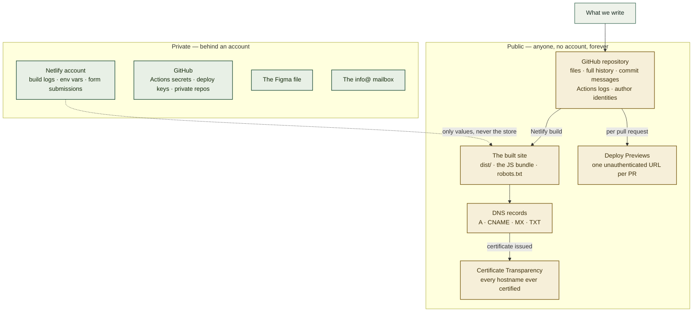

# What is public, and what is not

> **Reference, accurate as of 2026-09-11.** Not a task list. It describes the four surfaces this project publishes to and names what is exposed on each, so a decision to publish something is deliberate rather than discovered later. Re-check it whenever a new surface is added — a form endpoint, a subdomain, an analytics tag.

A public site and a public repository publish more than the page a visitor sees. Most of it is harmless and some of it is the point; the risk is the small set of things that got published because nobody asked. If you are here because you are about to add a secret to the build, skip to [Environment variables are not a secret store](#environment-variables-are-not-a-secret-store) — that is the mistake this document exists to prevent.

Nothing below is a breach. Everything below is a choice.

## Where this fits



The dashed edge is the one worth staring at: a private store can hand a value to a public artefact, and the value stops being private the moment it does.

## 1. The repository

Public since 2026-09-10. That publishes four things, not one.

**Every file, in every version it has ever had.** Deleting a file later does not unpublish it — the blob stays reachable by commit, and clones and forks keep their own copies regardless. This is why the first commit here was landed clean rather than as a vendor import followed by deletions: a 2.28 MB texture and 2,318 lines of generated code committed once would have been downloadable forever.

**Commit messages.** They are published prose, on the same terms as the files, and cannot be corrected after a push without rewriting history. Write them for a reader outside the company.

**The author identity in every commit.** Currently `Yukio Ueno <uqueno.asodb@gmail.com>` — a personal address, permanently attached to company work and harvestable in bulk from the API. GitHub issues a `users.noreply.github.com` address for exactly this. Changing it affects future commits only.

**Actions logs.** On a public repository, workflow logs are world-readable. Never echo into a workflow anything you would not publish — and note that an unset secret renders as an empty string rather than an error, so a log line can silently print nothing where a value was expected, or print the value where a mask was expected.

`pnpm-lock.yaml` also publishes exact dependency versions, which makes matching against known CVEs trivial. That is not a reason to hide the lockfile; it is a reason to leave Dependabot alerts on.

## 2. The built site

Everything in `dist/` is served to anyone. The JavaScript bundle carries **all** of the copy in both languages, the cost-calculator's logic, and its instance and pricing tables — `db.r6i.large`, `US$ 4,180` and the rest are readable in the bundle. That is intended: it is a marketing calculator, not a licensed model.

**Sourcemaps are not emitted.** `vite build` defaults to `sourcemap: false` in production and nothing overrides it, so `src/` is not republished alongside the bundle. Verified; keep it that way.

### Environment variables are not a secret store

**Any variable prefixed `VITE_` is inlined into the bundle at build time.** It is not read at runtime from a server; it is a literal in a file anyone can download. Netlify's UI calls it an "environment variable", which makes it sound protected. It is not.

The contact form will introduce `VITE_CONTACT_ENDPOINT`. That is safe *because the value is designed to be public* — a Netlify form name, or a Web3Forms access key that the vendor intends to ship in client code. An API key with server privileges behind the same prefix would be published to the world on the next deploy, and the only fix is to rotate it, because the bundle is already cached and forked.

Rule of thumb: if leaking it would matter, it cannot be in the front end at all. It needs an endpoint that holds the secret server-side.

## 3. Netlify

**Deploy Previews are public.** Every pull request publishes to `deploy-preview-<N>--<site>.netlify.app`, reachable with no account. Netlify sends `X-Robots-Tag: noindex` so they should stay out of search, but the URL is not a secret and `<N>` is sequential and guessable. Treat a preview as published: it is the right place to review a design, and the wrong place to park real customer data.

**The `<site>.netlify.app` address stays live after the custom domain is added.** The site then answers on two names, which splits SEO and lets people link the wrong one. Setting `datacaddy.co` as the primary domain makes Netlify redirect the other.

**Form submissions are stored on Netlify** and visible to anyone with account access. That is a data-processing fact, not just an operational one — it belongs in the LGPD notice as the processor.

## 4. DNS and TLS

**DNS is public by construction.** Anyone can enumerate `datacaddy.co`'s records. This is not a leak, but it is disclosure: the Netlify `CNAME` announces the host, and the Microsoft 365 mail records announce the tenant. That is normal and unavoidable; just know it is legible.

**Certificate Transparency is the one people forget.** Every TLS certificate issued for the domain is written to public, append-only logs and is searchable forever at `crt.sh`. The moment a hostname gets a certificate it becomes public knowledge, so **an unguessable subdomain is not a private one** — `staging.datacaddy.co` would be discoverable within minutes of its certificate being issued. Anything that must not be found needs authentication, not an obscure name.

**WHOIS** on a `.co` domain shows the registrant unless redacted. Cloudflare Registrar redacts by default — worth confirming rather than assuming.

## What stays private

| | |
|---|---|
| Netlify | The account, build logs, environment variable *values*, form submissions |
| GitHub | Actions secrets, deploy keys, the private sibling repository's contents |
| Figma | The design file and its history |
| Microsoft 365 | The `info@datacaddy.co` mailbox and its contents |

## Exposed today — decide, don't discover

Audited on 2026-09-11 across tracked files and commit messages. None of these is a secret, and none needs urgent action. Together they are a reasonable reconnaissance profile for a company that also runs a public bot endpoint on another domain, so they are worth deciding about rather than leaving by default.

| What | Where | Consideration |
|---|---|---|
| Personal Gmail as commit author | every commit | Permanent. A `noreply` address fixes it going forward |
| `integration-bot` named as a private sibling, with a self-hosted runner on an OCI VM | `AGENTS.md`, `CONTEXT.md`, both runbooks, `netlify.toml`, one commit message | Discloses the existence and deploy topology of a system that is otherwise private |
| Local key filenames, SSH alias, `adb:adb` group model, `newgrp` | `AGENTS.md` | Describes a host that is not this repository |
| Marcelo's first name and his role administering DNS | both runbooks | A named person and their responsibility |
| That the org's PAT is narrow and `gh pr merge` fails | `AGENTS.md` | Minor, but it is a statement about access control |

Confirmed **not** present: the workstation hostname, the WSL instance name, the production VM name, the bot's domain, and any IP address.

## Rules this produced

Flagged for adoption in `AGENTS.md` — these came out of writing this document and are not yet conventions.

1. **A public repository's documentation describes that repository.** Operational detail about other systems — a sibling's runner, host paths, group names, key filenames — belongs in the private repository that owns them. Grep for the other project's identifiers before committing.
2. **Commit messages are published prose.** Same audience as the README, and no edit after push.
3. **`VITE_*` is public by construction.** Never a secret, regardless of what the hosting UI calls it.
4. **Certificate Transparency makes every certified hostname public.** Never rely on an unguessable subdomain for privacy.
5. **Set the commit identity before the first commit of a public repository.** It cannot be corrected retroactively without rewriting history.
6. **Never echo into a workflow what you would not publish.** Logs are public on public repositories.

## Verify

```bash
# 1. Nothing from the other project leaked in
git grep -nEi 'ubuntu-adb|aso-ai-001|LT-|/opt/ai-oracle-msteams|bot\.asodb'

# 2. Commit identity
git log --all --format='%an <%ae>' | sort -u

# 3. No sourcemaps in the published build
ls dist/assets/*.map 2>/dev/null && echo 'SOURCEMAPS SHIPPED' || echo 'none'

# 4. Everything VITE_-prefixed is something you are content to publish
git grep -n 'VITE_'

# 5. Every hostname ever certified for the domain, as the world sees it
#    (browse, don't curl — the JSON is large)
#    https://crt.sh/?q=datacaddy.co
```

## Relationship to the other guides

- [`NETLIFY-SETUP.md`](NETLIFY-SETUP.md) covers standing the site up; this document covers what doing so exposes.
- `AGENTS.md` holds the conventions. Rules 1–6 above are proposed additions to it, not yet adopted.
- [ADR-0003](adr/0003-netlify-hosts-the-site-with-netlify-forms-for-contact.md) records why Netlify, including the Deploy Preview behaviour described here.

---

**pt-BR edition:** [`PUBLIC-SURFACE.pt-BR.md`](PUBLIC-SURFACE.pt-BR.md). Both stay in step on sections and literal values.
