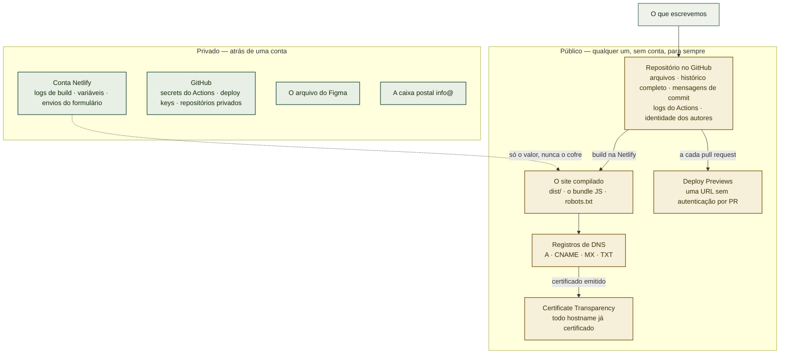

# O que é público, e o que não é

> **Referência, correta em 2026-09-11.** Não é uma lista de tarefas. Descreve as quatro superfícies em que este projeto publica e nomeia o que fica exposto em cada uma, para que publicar algo seja uma decisão e não uma descoberta posterior. Reveja sempre que surgir uma superfície nova — um endpoint de formulário, um subdomínio, uma tag de analytics.

Um site público e um repositório público publicam mais do que a página que o visitante vê. Quase tudo é inofensivo e parte disso é justamente o objetivo; o risco está no pequeno conjunto de coisas que foram publicadas porque ninguém perguntou. Se você chegou aqui prestes a colocar um segredo no build, vá direto para [Variável de ambiente não é cofre de segredo](#variável-de-ambiente-não-é-cofre-de-segredo) — é esse o erro que este documento existe para evitar.

Nada abaixo é um vazamento. Tudo abaixo é uma escolha.

## Onde isso se encaixa



A seta tracejada é a que merece atenção: um cofre privado pode entregar um valor a um artefato público, e o valor deixa de ser privado no instante em que isso acontece.

## 1. O repositório

Público desde 2026-09-10. Isso publica quatro coisas, não uma.

**Cada arquivo, em cada versão que já teve.** Apagar um arquivo depois não o despublica — o blob continua alcançável pelo commit, e clones e forks guardam as próprias cópias de qualquer forma. Foi por isso que o primeiro commit aqui já entrou limpo, em vez de ser uma importação seguida de remoções: uma textura de 2,28 MB e 2.318 linhas de código gerado, commitadas uma vez, ficariam disponíveis para download para sempre.

**As mensagens de commit.** São texto publicado, nas mesmas condições dos arquivos, e não podem ser corrigidas depois do push sem reescrever o histórico. Escreva-as para alguém de fora da empresa.

**A identidade do autor em cada commit.** Hoje `Yukio Ueno <uqueno.asodb@gmail.com>` — um endereço pessoal, ligado permanentemente a trabalho da empresa e coletável em massa pela API. O GitHub fornece um endereço `users.noreply.github.com` exatamente para isso. Trocar afeta apenas os commits seguintes.

**Os logs do Actions.** Em repositório público, os logs de workflow são legíveis por qualquer um. Nunca ecoe num workflow algo que você não publicaria — e note que um secret não definido vira string vazia em vez de erro, então uma linha de log pode silenciosamente imprimir nada onde se esperava um valor, ou imprimir o valor onde se esperava uma máscara.

O `pnpm-lock.yaml` também publica as versões exatas das dependências, o que torna trivial cruzá-las com CVEs conhecidas. Isso não é motivo para esconder o lockfile; é motivo para manter os alertas do Dependabot ligados.

## 2. O site compilado

Tudo em `dist/` é servido a qualquer um. O bundle JavaScript carrega **todo** o texto nos dois idiomas, a lógica da calculadora de custo e suas tabelas de instâncias e preços — `db.r6i.large`, `US$ 4.180` e o resto são legíveis no bundle. Isso é intencional: é uma calculadora de marketing, não um modelo licenciado.

**Sourcemaps não são gerados.** O `vite build` usa `sourcemap: false` em produção por padrão e nada sobrescreve isso, então `src/` não é republicado junto do bundle. Verificado; mantenha assim.

### Variável de ambiente não é cofre de segredo

**Toda variável com prefixo `VITE_` é embutida no bundle no momento do build.** Ela não é lida em tempo de execução a partir de um servidor; é um literal num arquivo que qualquer um baixa. A interface da Netlify chama isso de "variável de ambiente", o que soa protegido. Não é.

O formulário de contato vai introduzir `VITE_CONTACT_ENDPOINT`. Isso é seguro *porque o valor é feito para ser público* — um nome de formulário da Netlify, ou uma access key do Web3Forms que o próprio fornecedor pretende que apareça no código do cliente. Uma chave de API com privilégios de servidor sob o mesmo prefixo seria publicada para o mundo no próximo deploy, e a única correção é rotacioná-la, porque o bundle já está em cache e já foi copiado.

Regra prática: se o vazamento importaria, aquilo não pode estar no front-end de forma alguma. Precisa de um endpoint que guarde o segredo no servidor.

## 3. Netlify

**Deploy Previews são públicos.** Cada pull request publica em `deploy-preview-<N>--<site>.netlify.app`, acessível sem conta. A Netlify envia `X-Robots-Tag: noindex`, então não deveriam aparecer em buscas, mas a URL não é secreta e `<N>` é sequencial e adivinhável. Trate um preview como publicado: é o lugar certo para revisar um design, e o lugar errado para deixar dados reais de cliente.

**O endereço `<site>.netlify.app` continua no ar depois que o domínio próprio é adicionado.** O site passa a responder por dois nomes, o que divide o SEO e permite que alguém divulgue o errado. Definir `datacaddy.co` como domínio primário faz a Netlify redirecionar o outro.

**Os envios do formulário ficam armazenados na Netlify** e visíveis a quem tem acesso à conta. Isso é um fato de tratamento de dados, não só operacional — entra no aviso de LGPD como operador.

## 4. DNS e TLS

**DNS é público por construção.** Qualquer um pode enumerar os registros de `datacaddy.co`. Não é vazamento, mas é divulgação: o `CNAME` da Netlify anuncia o provedor, e os registros de e-mail do Microsoft 365 anunciam o tenant. É normal e inevitável; apenas saiba que é legível.

**Certificate Transparency é o que as pessoas esquecem.** Todo certificado TLS emitido para o domínio é gravado em logs públicos, apenas-anexar, e fica pesquisável para sempre em `crt.sh`. No instante em que um hostname recebe certificado, ele vira conhecimento público — portanto **um subdomínio difícil de adivinhar não é um subdomínio privado**: `staging.datacaddy.co` seria descoberto em minutos após a emissão do certificado. O que não pode ser encontrado precisa de autenticação, não de um nome obscuro.

**WHOIS** num domínio `.co` mostra o registrante, a menos que haja redação. O Cloudflare Registrar faz redação por padrão — vale confirmar em vez de presumir.

## O que permanece privado

| | |
|---|---|
| Netlify | A conta, os logs de build, os *valores* das variáveis, os envios do formulário |
| GitHub | Secrets do Actions, deploy keys, o conteúdo do repositório irmão privado |
| Figma | O arquivo de design e seu histórico |
| Microsoft 365 | A caixa `info@datacaddy.co` e seu conteúdo |

## Exposto hoje — decida, não descubra

Auditado em 2026-09-11 nos arquivos versionados e nas mensagens de commit. Nenhum destes é um segredo, e nenhum exige ação urgente. Em conjunto, formam um perfil razoável de reconhecimento para uma empresa que também mantém um endpoint de bot público em outro domínio, então vale decidir sobre eles em vez de deixá-los por omissão.

| O quê | Onde | Consideração |
|---|---|---|
| Gmail pessoal como autor dos commits | todos os commits | Permanente. Um endereço `noreply` resolve daqui para a frente |
| `integration-bot` citado como irmão privado, com runner auto-hospedado numa VM da OCI | `AGENTS.md`, `CONTEXT.md`, os dois runbooks, `netlify.toml`, uma mensagem de commit | Revela a existência e a topologia de deploy de um sistema que, no mais, é privado |
| Nomes de chave locais, alias SSH, modelo de grupo `adb:adb`, `newgrp` | `AGENTS.md` | Descreve um host que não é este repositório |
| O primeiro nome do Marcelo e seu papel na administração do DNS | os dois runbooks | Uma pessoa nomeada e sua responsabilidade |
| Que o PAT da organização é restrito e que `gh pr merge` falha | `AGENTS.md` | Menor, mas é uma afirmação sobre controle de acesso |

Confirmado como **ausente**: o nome da estação de trabalho, o nome da instância WSL, o nome da VM de produção, o domínio do bot e qualquer endereço IP.

## Regras que isto produziu

Sinalizadas para adoção no `AGENTS.md` — surgiram ao escrever este documento e ainda não são convenções.

1. **A documentação de um repositório público descreve aquele repositório.** Detalhe operacional de outros sistemas — o runner de um irmão, caminhos de host, nomes de grupo, nomes de arquivo de chave — pertence ao repositório privado que os possui. Faça grep pelos identificadores do outro projeto antes de commitar.
2. **Mensagens de commit são texto publicado.** Mesmo público do README, e sem edição depois do push.
3. **`VITE_*` é público por construção.** Nunca um segredo, independentemente de como a interface de hospedagem o chame.
4. **Certificate Transparency torna público todo hostname certificado.** Nunca conte com um subdomínio difícil de adivinhar como medida de privacidade.
5. **Defina a identidade de commit antes do primeiro commit de um repositório público.** Não dá para corrigir retroativamente sem reescrever o histórico.
6. **Nunca ecoe num workflow o que você não publicaria.** Em repositórios públicos, os logs são públicos.

## Verificação

```bash
# 1. Nada do outro projeto vazou para cá
git grep -nEi 'ubuntu-adb|aso-ai-001|LT-|/opt/ai-oracle-msteams|bot\.asodb'

# 2. Identidade dos commits
git log --all --format='%an <%ae>' | sort -u

# 3. Sem sourcemaps no build publicado
ls dist/assets/*.map 2>/dev/null && echo 'SOURCEMAPS PUBLICADOS' || echo 'nenhum'

# 4. Tudo com prefixo VITE_ é algo que você aceita publicar
git grep -n 'VITE_'

# 5. Todo hostname já certificado para o domínio, como o mundo enxerga
#    (abra no navegador, não com curl — o JSON é grande)
#    https://crt.sh/?q=datacaddy.co
```

## Relação com os outros guias

- O [`NETLIFY-SETUP.pt-BR.md`](NETLIFY-SETUP.pt-BR.md) cobre colocar o site no ar; este documento cobre o que isso expõe.
- O `AGENTS.md` guarda as convenções. As regras 1 a 6 acima são adições propostas a ele, ainda não adotadas.
- O ADR-0003 (ainda não escrito) registrará por que Netlify, incluindo o comportamento dos Deploy Previews descrito aqui.

---

**Edição em inglês:** [`PUBLIC-SURFACE.md`](PUBLIC-SURFACE.md). As duas se mantêm em sincronia em seções e valores literais.
